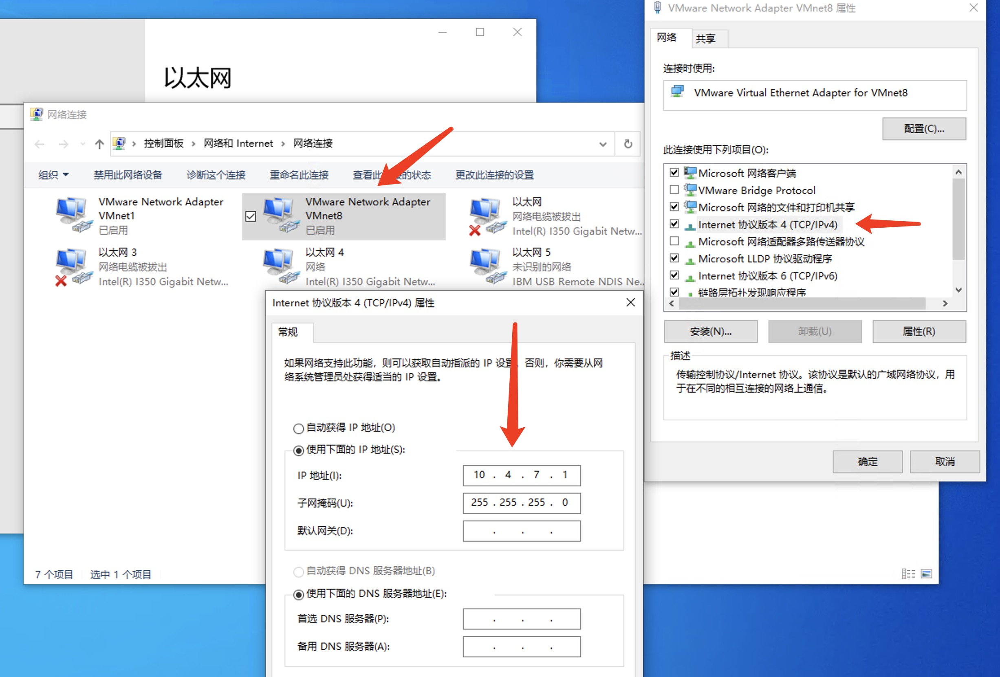
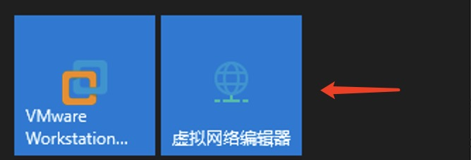
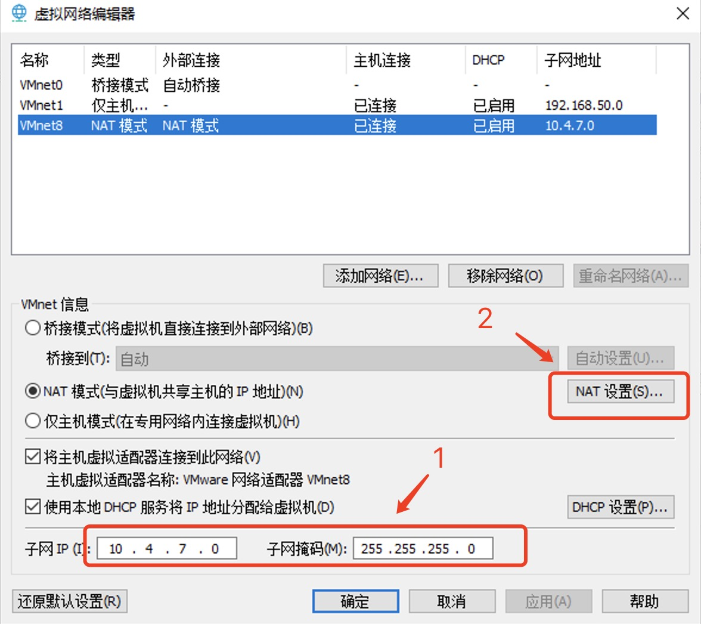
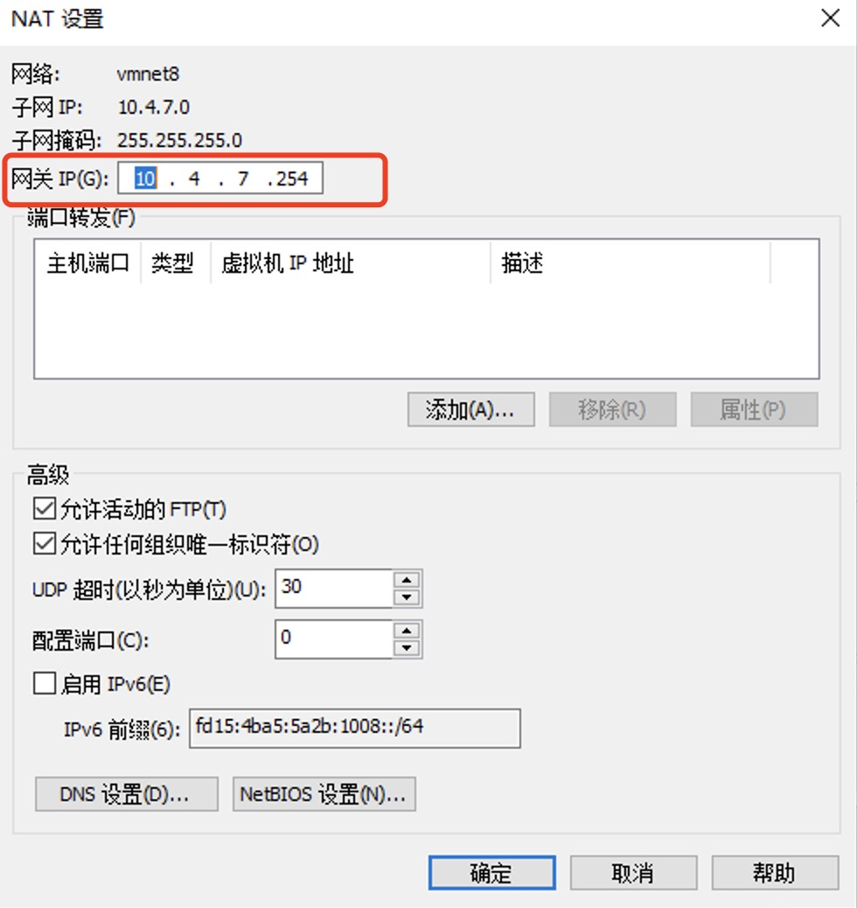

> 以下操作，参考 https://github.com/ben1234560/k8s_PaaS/blob/master/%E7%AC%AC%E4%BA%8C%E7%AB%A0%E2%80%94%E2%80%94%E4%BC%81%E4%B8%9A%E9%83%A8%E7%BD%B2%E5%AE%9E%E6%88%98_K8S.md  
以Windows操作系统为宿主机系统 

## VMware Workstation
VM配置静态IP

`步骤`

### 1. VMware Network Adapter VMnet8配置 
```
IP地址： 10.4.7.1
子网掩码： 255.255.255.0
``` 


### 2. VMware 虚拟网络编辑器配置
打开VMware的虚拟网络编辑器  


虚拟网络编辑器配置  
```
#DHCP配置
子网IP： 10.4.7.0
子网掩码： 255.255.255.0

#NAT配置
网关IP： 10.4.7.254
```




### 3. 虚拟机设置

`网络适配器`


`克隆虚拟机，重新生成Mac地址` 


## 10.4.7.11


以下所有操作均基于Centos7操作系统

## 基本环境配置

1. 关闭selinux
```shell
setenforce 0
sed -i "s/SELINUX=enforcing/SELINUX=disabled/g" /etc/selinux/config
sed -i 's/enforcing/disabled/' /etc/selinux/config
```

2. 关闭swap分区或禁用swap文件
```shell
swapoff -a
sed -ri 's/.*swap.*/#&/' /etc/fstab


# 注释掉关于swap分区的行
yes | cp /etc/fstab /etc/fstab_bak
cat /etc/fstab_bak |grep -v swap > /etc/fstab
```


3. 修改网卡配置
```shell
vim /etc/sysctl.conf
net.ipv4.ip_forward = 1
net.bridge.bridge-nf-call-iptables = 1
net.bridge.bridge-nf-call-ip6tables = 1
sysctl -p
```


cat > /etc/sysctl.d/k8s.conf << EOF
net.bridge.bridge-nf-call-iptables = 1
net.bridge.bridge-nf-call-ip6tables = 1
EOF
sysctl --system


4. 启用内核模块
```shell
vim /etc/sysconfig/modules/ipvs.modules
modprobe -- ip_vs
modprobe -- ip_vs_rr
modprobe -- ip_vs_wrr
modprobe -- ip_vs_sh
modprobe -- nf_conntrack_ipv4

cut -f1 -d " " /proc/modules |grep -e ip_vs -e nf_conntrack_ipv4


```

5. 关闭防火墙
```shell
systemctl stop firewalld
systemctl disable firewalld
```

6. 配置hosts
hostnamectl set-hostname vm01.com


### kubectl、kubeadm、kubelet的安装
#### 添加Kubernetes的yum源
此处使用alibaba的镜像源
```shell
vim /etc/yum.repos.d/kubernetes.repo
[kubernetes]
name=Kubernetes
baseurl=http://mirrors.aliyun.com/kubernetes/yum/repos/kubernetes-el7-x86_64
enabled=1
gpgcheck=0
repo_gpgcheck=0
gpgkey=http://mirrors.aliyun.com/kubernetes/yum/doc/yum-key.gpg
        http://mirrors.aliyun.com/kubernetes/yum/doc/rpm-package-key.gpg


cat <<EOF > /etc/yum.repos.d/kubernetes.repo
[kubernetes]
name=Kubernetes
baseurl=https://mirrors.aliyun.com/kubernetes/yum/repos/kubernetes-el7-x86_64/
enabled=1
gpgcheck=0
repo_gpgcheck=0
gpgkey=https://mirrors.aliyun.com/kubernetes/yum/doc/yum-key.gpg https://mirrors.aliyun.com/kubernetes/yum/doc/rpm-package-key.gpg
EOF

```

#### 安装kubelet、kubeadm、kubectl
```shell
yum install -y kubelet-1.20.5 kubeadm-1.20.5 kubectl-1.20.5
```

#### 启动kubelet服务
```shell
systemctl enable kubelet
systemctl start kubelet
systemctl status kubelet
```

此时执行`systemctl status kubelet`查看服务状态，服务状态应为Error(255)
如果是其他错误可使用`journalctl -xe`查看错误信息


### Docker安装和配置
#### Docker安装
docker的安装请查看官网文档(Install Docker Engine on CentOS)[https://docs.docker.com/engine/install/centos/]


```shell
yum install -y yum-utils

yum-config-manager \
    --add-repo \
    https://download.docker.com/linux/centos/docker-ce.repo

yum install docker-ce docker-ce-cli containerd.io

systemctl start docker

systemctl status docker
```

1. 配置docker加速地址
sudo mkdir -p /etc/docker
sudo tee /etc/docker/daemon.json <<-'EOF'
{
  "registry-mirrors": ["https://x5rrpxxo.mirror.aliyuncs.com"]
}
EOF
sudo systemctl daemon-reload
sudo systemctl restart docker

并且设置开机启动 systemctl enable docker


2. master节点初始化
kubeadm init \
--apiserver-advertise-address=dellvm01.com \
--image-repository registry.cn-hangzhou.aliyuncs.com/google_containers \
--kubernetes-version v1.20.5 \
--service-cidr=10.96.0.0/16 \
--pod-network-cidr=10.244.0.0/16


2. 配置cgroup-driver为systemd
```shell
#查看cgroup-driver
docker info | grep -i cgroup
#追加 --exec-opt native.cgroupdriver=systemd 参数


修改docker配置文件

vim /etc/docker/daemon.json
{
    "exec-opts":["native.cgroupdriver=systemd"]
}
systemctl restart docker

```

2. 预先拉取所需镜像
```shell
# 查看kubeadm所需镜像
kubeadm config images list
k8s.gcr.io/kube-apiserver:v1.20.5
k8s.gcr.io/kube-controller-manager:v1.20.5
k8s.gcr.io/kube-scheduler:v1.20.5
k8s.gcr.io/kube-proxy:v1.20.5
k8s.gcr.io/pause:3.2
k8s.gcr.io/etcd:3.4.13-0
k8s.gcr.io/coredns:1.7.0

```

docker pull aiotceo/kube-apiserver:v1.20.5
docker pull aiotceo/kube-controller-manager:v1.20.5
docker pull aiotceo/kube-scheduler:v1.20.5
docker pull aiotceo/kube-proxy:v1.20.5
docker pull codedingan/pause:3.2
docker pull bantianyinshi/etcd:3.4.13-0
docker pull coredns/coredns:1.7.0


cat > /etc/yum.repos.d/kubernetes.repo << EOF
[kubernetes]
name=Kubernetes
baseurl=https://mirrors.aliyun.com/kubernetes/yum/repos/kubernetes-el7-x86_64
enabled=1
gpgcheck=0
repo_gpgcheck=0
gpgkey=https://mirrors.aliyun.com/kubernetes/yum/doc/yum-key.gpg
        https://mirrors.aliyun.com/kubernetes/yum/doc/rpm-package-key.gpg
EOF


https://blog.csdn.net/networken/article/details/84571373

拉取镜像脚本

k8s.gcr.io/kube-apiserver:v1.20.5
k8s.gcr.io/kube-controller-manager:v1.20.5
k8s.gcr.io/kube-scheduler:v1.20.5
k8s.gcr.io/kube-proxy:v1.20.5
k8s.gcr.io/pause:3.2
k8s.gcr.io/etcd:3.4.13-0
k8s.gcr.io/coredns:1.7.0

```shell

#!/bin/bash

images=(
  kube-apiserver:v1.20.5
  kube-controller-manager:v1.20.5
  kube-scheduler:v1.20.5
  kube-proxy:v1.20.5
  pause:3.2
  etcd:3.4.13-0
  coredns:1.7.0
)

for imageName in ${images[@]} ; do
  docker pull registry.cn-hangzhou.aliyuncs.com/google_containers/$imageName
  #docker tag registry.cn-hangzhou.aliyuncs.com/google_containers/$imageName k8s.gcr.io/$imageName
done


```


kubeadm init \
--apiserver-advertise-address=192.168.56.20 \
--image-repository registry.cn-hangzhou.aliyuncs.com/google_containers \
--kubernetes-version v1.20.5 \
--service-cidr=10.96.0.0/16 \
--pod-network-cidr=10.244.0.0/16


mkdir -p $HOME/.kube
cp -i /etc/kubernetes/admin.conf $HOME/.kube/config
chown $(id -u):$(id -g) $HOME/.kube/config

kubeadm join 192.168.56.20:6443 --token 5tfkpl.3zvzbll725kvzt51 \
    --discovery-token-ca-cert-hash sha256:801387081ef923633d3b24622c9b97a44ccdb133f1bf6bad


安装网络插件 Flannel
https://github.com/flannel-io/flannel

kubectl apply -f https://raw.githubusercontent.com/coreos/flannel/master/Documentation/kube-flannel.yml


kubectl get nodes -o wide

[root@vm01 ~]# kubeadm token create --print-join-command
kubeadm join vm01.com:6443 --token am7eun.7ht71gzlhgh6feol     --discovery-token-ca-cert-hash sha256:801387081ef923633d3b24622c9b97a44ccdb133f1bf6badafba049d8e99d752