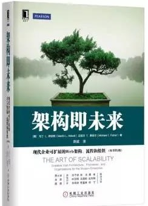
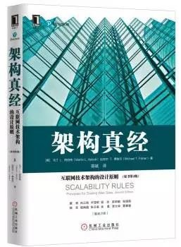
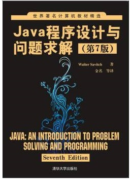
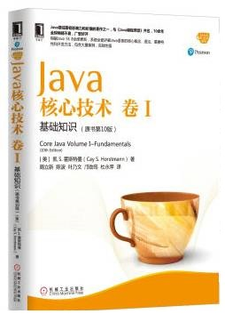
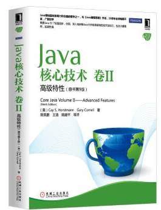
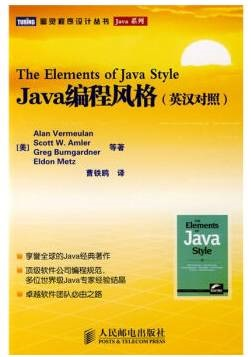
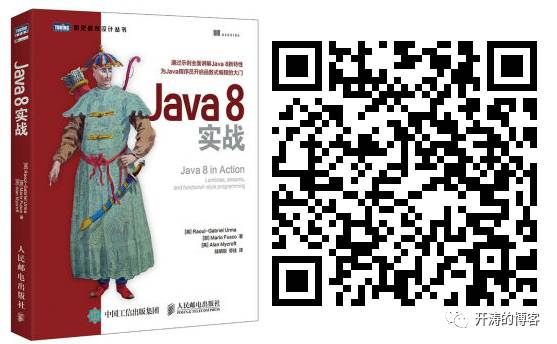
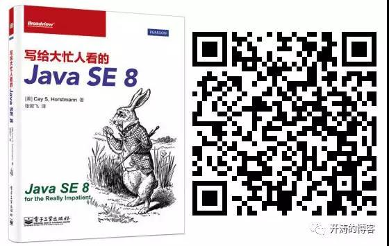
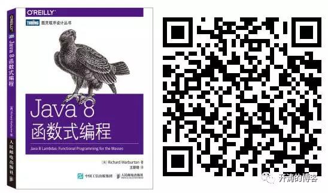

## Java 书单

| 书名      |    图片 | 描述  |
| :-------- | :--------:| :---- |
| 架构即未来     |    |  这本书不仅仅介绍技术层面的可扩展，还有人员、组织、流程等更系统化的层面介绍，书中很多内容是我现阶段需要的，如果您需要从人员、组织、流程和技术方面系统化搭建可扩展性的企业，这本书非常适合您  |
| 架构真经     |  |  略 |
| Java程序设计与问题求解  |  |  本书不仅介绍Java语法知识，而且通过大量案例研究、编程示例，着重讲授问题求解和编程技术，如循环设计技术、调试技巧、风格技术、抽象数据类型以及面向对象编程技术，包括UML、事件驱动编程以及使用类型参数的泛型编程等。本书不仅在每章中间安排了大量自测题，而且在每章末尾还给出了练题、编程实践和编程项目，帮助读者掌握和加深所学知识，是高等学校计算机及相关专业以Java为语言讲授计算机科学课程的理想教材   |
| Java编程思想      |   | 从《计算机科学丛书：Java编程思想（第4版）》获得的各项大奖以及来自世界各地的读者评论中，不难看出这是一本经典之作。本书的作者拥有多年教学经验，对C、C++以及Java语言都有独到、深入的见解，以通俗易懂及小而直接的示例解释了一个个晦涩抽象的概念。本书共22章，包括操作符、控制执行流程、访问权限控制、复用类、多态、接口、通过异常处理错误、字符串、泛型、数组、容器深入研究、JavaI/O系统、枚举类型、并发以及图形化用户界面等内容。这些丰富的内容，包含了Java语言基础语法以及高级特性，适合各个层次的Java程序员阅读，同时也是高等院校讲授面向对象程序设计语言以及Java语言的好教材和参考书。  |
| Java核心技术卷I 卷II      |     | 系统全面讲解了Java 8的核心概念、语法、重要特性和开发方法，包含大量案例，实践性强。我入门时通读了卷1 卷2 ,系统全面讲解Java 7语言的核心概念、语法、重要特性和开发方法。本书全面覆盖Java技术的高级主题，包括流与文件、XML、网络、数据库编程、国际化等，详细描述了图形与GUI编程，还涉及安全、远程方法、注解处理、本地方法等。本书对Java技术的阐述精确到位，叙述方式深入浅出，并包含大量示例代码，能够帮助读者充分理解Java语言并灵活应用 |
| Java编程风格      |    | 《Java编程风格(英汉对照)》是凝聚了业界众多专家集体智慧结晶的Java 编程风格指南，书中提供了一系列标准和规范，涉及多方面的约定，包括格式、命名、文档、程序和包，有助于编写易于理解、维护和扩展的Java 代码。 |
| Java8实战      |    | 本书全面介绍了Java 8 这个里程碑版本的新特性，包括Lambdas、流和函数式编程。有了函数式的编程特性，可以让代码更简洁，同时也能自动化地利用多核硬件。全书分四个部分：基础知识、函数式数据处理、高效Java 8 编程和超越Java 8，清晰明了地向读者展现了一幅Java 与时俱进的现代化画卷。|
| 写给大忙人看的Java SE 8      |    | 《写给大忙人看的Java SE 8》共分为9章。第1章讲述了lambda表达式的全部语法；第2章给出了流的完整概述；第3章给出了使用lambda表达式设计库的有效技巧；第4章介绍了JavaFX；第5章详细介绍了Java新增的日期/时间API；第6章介绍了原子计数器、并发哈希映射、并行数组操作等特性中的改进；第7章介绍了如何在Java虚拟机上执行JavaScript，以及如何与Java代码进行交互操作；第8章描述了Java 8中其他一些不起眼但很实用的特性；第9章则关注于Java 7中改进的异常处理，以及其他一些你可能会忽略掉的API。|
| Java8函数式编程      |    | 《写给大忙人看的Java SE 8》共分为9章。第1章讲述了lambda表达式的全部语法；第2章给出了流的完整概述；第3章给出了使用lambda表达式设计库的有效技巧；第4章介绍了JavaFX；第5章详细介绍了Java新增的日期/时间API；第6章介绍了原子计数器、并发哈希映射、并行数组操作等特性中的改进；第7章介绍了如何在Java虚拟机上执行JavaScript，以及如何与Java代码进行交互操作；第8章描述了Java 8中其他一些不起眼但很实用的特性；第9章则关注于Java 7中改进的异常处理，以及其他一些你可能会忽略掉的API。|

