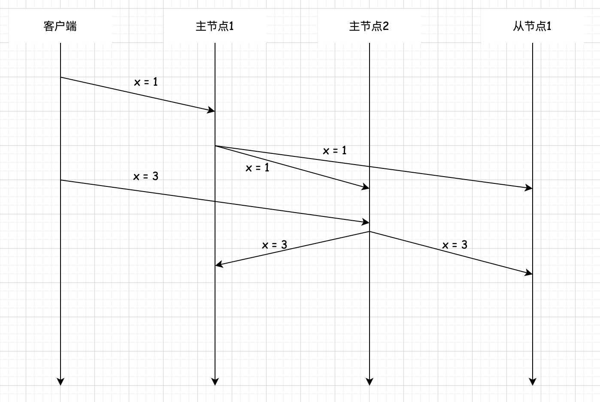

## 分布式数据 复制 多主复制 
正如我们在单主复制中所看到的,单主复制易于实现，适合大量读工作负载的系统。但单主复制只有一个主节点，在写性能、可扩展性方面有着一定的局限性。对于写请求负载要求严格的系统,一个自然的想法是增加多个主节点来分担写请求的负载。这种由多个节点充当主节点的数据复制方式称为多主复制。多主复制流程如下图所示。      

   

`多主复制和单主复制的显著区别是`，由于多主复制不止一个节点处理写请求,且网络存在延迟,这就意味着节点可能会对某些请求的正确顺序产生分歧,导致多个节点上的数据不一致,这种现象简称为数据冲突。例如下图中的情况,由于写操作X=1 同步延迟,导致最后主节点1 和从节点上的X的值为3,而主节点2上的X的值为1。这当然会引起很大的麻烦,因此系统必须要解决数据冲突。     

`其实数据冲突在单主复制中也会出现，只不过单主复制的数据冲突通常直接以主节点的数据作为最终数据,不需要很复杂的逻辑。关于数据冲突有一个十分有趣的评价，分布式存储系统 Riak 的开发者曾发文调侃:“如果你的分布式系统没有清楚地处理数据冲突,那么任何正确的行为都是良好的运气,而不是良好的设计。”`            

为了使系统在这种情况下仍然能够正常运行,必须解决数据冲突。最好的解决方法是避免冲突产生，例如，特定账号总是交给特定的主节点来处理，可以通过一个哈希函数来将特定账户的所有请求路由到相同的主节点上，这样可以避免同一份数据在多个节点上更新，在一定程度上避免冲突的产生。           

有时冲突无法避免,根据系统特性,解决冲突的办法有多种,一些常见的冲突解决方法有:    

(1)`由客户端解决冲突。`这种方法的具体解决方案是,在客户端下次读取系统中冲突数据的时候,将冲突的数据全部返回给客户端,客户端选择合适的数据并返回给存储系统，存储系统以此数据作为最终确认的数据,覆盖所有冲突的数据。一个典型的例子是购物车应用，购物车应用解决冲突的逻辑是保留购物车中所有冲突的商品,并全部返回给用户。用户看到购物车里出现了被删除的物品或重复的物品,会重新选择购物车里的商品数量,然后将此数据重新写入存储系统，以此解决冲突。        

(2)`最后写入胜利(LWW,Last Write Wins)。`最后写入胜利是让系统中的每个节点为每个写入请求标记上唯一时间戳或唯一自增 ID,当冲突发生时,系统选择具有最新时间戳或最新ID 版本的数据,并丢弃其他写入的数据。但正如之前我们已经讨论过的,由于分布式系统很难有一个统一的全局时间概念,这种技术可能导致一些意想不到的行为,可能会造成数据丢失。  

(3)`因果关系跟踪。`系统使用一种算法来跟踪不同请求之间的因果关系,并以此判断请求的先后顺序。举个例子,当写请求A 和写请求B之间发生冲突时,系统尝试确认一个请求是另一个请求的原因。更具体的,假设写请求A 是一个发帖操作,写请求B是一个对应的回帖操作,由于先有发帖操作才会产生回帖操作,那么写请求 B必然是在写请求A 之后发生的。这种关系也称为“发生于.·....·之前”关系。`因果关系跟踪的局限性是仍然有一些不存在因果关系的并发写请求，对此系统无法做出决定。`   

另外，还有一种被称为`无冲突复制数据类型(Conflict-Free Replicated Data Type,CRDT)的数据结构`, 能够根据一定规则自动解决冲突,副本之间不需要额外的协调和冲突处理。无冲突复制数据类型总是可以自己解决出现的不一致性问题。Riak和 Cosmos DB 中都有实现无冲突复制数据类型。无冲突复制数据类型常用于在线聊天系统和协作式文本编辑系统。据悉，苹果公司自带的应用程序备忘录中就实现了无冲突复制数据类型,用于同步和协调多个设备之间编辑的文本。  

遗憾的是，冲突处理没有一种能够覆盖所有场景的方法,有时可能需要多种方案组合起来解决冲突。     

综上所述，多主复制的优点有:  
(1)增加主节点的容错性。一个主节点发生故障时，另一个主节点仍然能够工作。 
(2)可以在多个节点上执行写请求,分担写负载的压力。        
(3)应用程序可以将写请求路由到不同的主节点,通常来说会路由到地理位置最近的节点,以减少往返时间，提升写请求的响应速度。     

多主复制最主要的缺点是它的复杂性，由于可以在多个节点上执行写操作，可能经常产生数据冲突。随着节点数量的增加,有时无法很好地解决产生的数据冲突，需要人工干预。极端情况下可能造成数据损坏。     

`由于多主复制带来的复杂性远超它的好处，因此很少会在单个数据中心使用多主复制来构建分布式系统`。多主复制一般用于多个数据中心的存储系统,避免写请求跨越数据中心。例如一个全球服务,在全球多地有多个数据中心，此时可以将请求路由到地理位置更近的数据中心中的主节点，以加快访问速度。      

