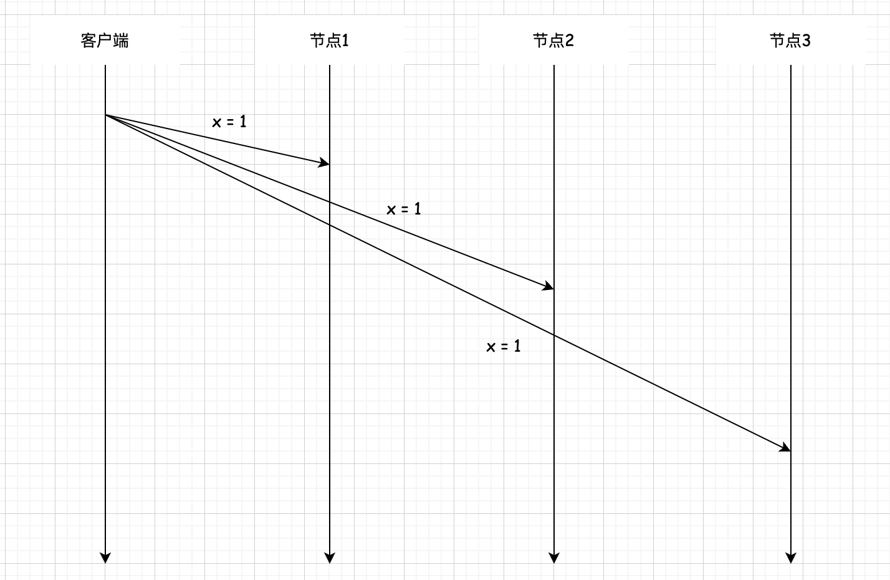
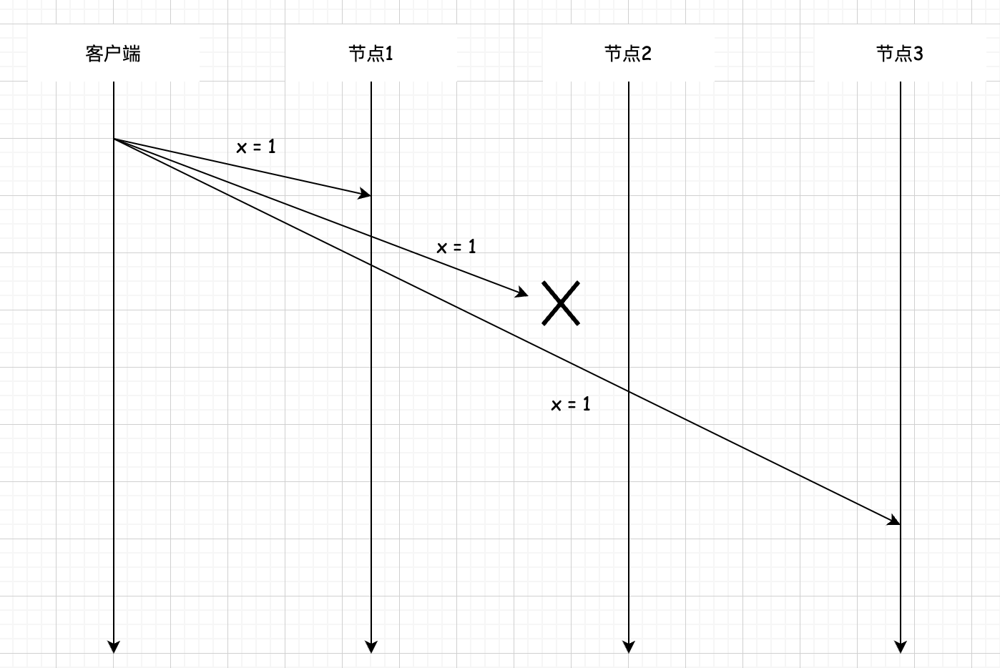

## 分布式数据 复制 无主复制 

### 介绍     
了解到单主复制和多主复制的基本流程都是: 客户端只向其中一个或多个主节点发送写请求,然后系统负责将该写请求复制到其他副本，主节点决定写请求的顺序,从节点以同样的顺序执行写写操作。  

另一种`复制技术完全没有主节点,称为无主复制`,尽管无主复制技术在几十年前就出现了,但直到亚马逊发布了 Dynamo 架构'的论文,并在其中使用了无主复制,才让该技术重新引起广泛关注。鉴于 Dynamo 的大获成功,无主复制变得流行起来,成为大家的学习对象,并启发了其他许多 NOSOL 数据库实现,比如 Apache Cassandra、Project Voldemort 和 Riak。无主复制有时也叫 Dynamo 架构 (Dynamo-Style)。    

有趣的是，亚马逊云计算服务(亚马逊网络服务) 提供一个名为亚马逊动态数据库的服务，但动态数据库架构是基于无主复制的,而亚马逊动态数据库使用单主同步复制架构。

无主复制初看起来一团糟,想象一下系统中的每个节点可能都在执行不同的写操作，整个系统会是什么样的?这种方法似乎非常不可靠，只会带来一片混乱。        

事实上，这些分布式系统领域的专家非常聪明,他们提出了一些巧妙的方法来应对这些混乱的情况。     

无主复制的基本思想是,客户端不仅向一个节点发送写请求,而是将请求发送到多个节点,在某些情况下甚至会发送给所有节点,如下图所示。      
      

客户端将写请求并发地发送给几个节点后,一旦得到其中一些节点的确认响应(我们即将讨论具体需要多少个节点的确认信息),就认为这次写成功了,然后继续发送下一个请求。   

>无主复制有着不同的协调请求方式，一种是客户端直接将写操作发送到多个副本,而另一种是在节点中选出一个协调节点,客户端将请求发送到协调节点,再由协调节点代表客户端将写操作转发到多个副本,经过多个副本确认后再由协调节点响应客户端。与基于领导者的复制不同,无主复制不强制写操作的顺序。            

`无主复制的优势是,我们可以更轻松地容忍节点故障`,回想前面说到的基于领导者的复制,必须由领导者来确认写请求,一旦领导者由于网络或机器故障等原因没有响应,整个系统将无法正常工作。无主复制直接去掉了领导者,只要能够满足写入数量的节点可用,系统仍然被认为是正常运行的。     

“天下没有免费的午餐”,`写入多个节点最容易出现的问题是:冲突更多了`。如下图所示，如果写请求在节点1和节点3上成功,但在节点2上失败了,那么此时分布式存储系统中有两个节点上存储了新的值,但有一个节点存储了旧的值。        

      

如果此时读取数据,则客户端既可能读到旧的数据,也可能读到新的数据,系统肯定不能这样工作。   

`为了解决这个问题`，和写请求一样,客户端不止会从一个节点读取数据,读请求也会同时发送给多个节点，然后获取节点上的数据和数据的版本号,客户端可以根据所有响应中的版本号决定应该使用哪个值,应该丢弃哪个值。    

虽然这种情况下客户端可以识别出旧的数据,但我们仍然需要修复旧的数据，不能放任旧的数据一直在那。因此需要以某种方式将其与其他节点的数据保持一致，毕竟,复制技术的目的是让多个节点存储相同的数据。    

`Dynamo 架构中同时使用了以下两种数据修复方法:`  
(1)读修复(Read Repair)。读修复其实就是多主复制中提到的让客户端负责更新数据。前面提到，当客户端从多个节点读取到数据后,它可以检测到其中有的节点的数据是旧的，此时客户端会发送一个带有最新的值的写请求到旧数据所在的节点，以此更新节点的数据。 

(2) 反过程(Anti-Entropy Process)。反熵过程会新建一个后台进程来修复数据，该进程找出错误的数据,并从存储最新的数据的节点中将数据复制到错误的节点。和基于领导者的复制不同,反熵过程不保证写操作的顺序,只保证最后结果一样。   

进行反熵过程修复时，我们肯定不希望一个个比较数据是否一致,这需要传输很多数据进行对比。Dynamo 使用 `Merkle Tree` 来验证数据是否产生了不一致,减少了传输的数据量。  
Merkle Tree 也叫哈希树(Hash Tree),它把数据按关键字分为几个范围,每个范围计算出一个哈希值并作为树的叶子节点,然后自底向上一层层合并到根节点。Merkle Tree 的特点是，树的每个分支都可以独立进行对比,不要求完全传输整棵树;同时,如果两棵树的根节点相同,那么叶子节点的值也相同,就不需要再检查了;如果根节点不同,则说明某些副本的数据不同,此时继续往子节点中查找(只传输这部分子节点的数据),直到叶子节点找到不同的关键字所在的范围。        

通过从 Merkle Tree 的根节点开始比较哈希值,就能快速找到哪些范围的哈希值发生了变化,快速定位不一致的数据，并且只传输较少的数据进行比较。       

请注意，并非所有无主复制系统都需要实现读修复和反熵过程。例如 Voldemort 就没有实现反熵过程。对于没有反熵过程的系统,如果一些数据很久没有被读到，就不会执行读修复,那么某些副本上可能会缺少这些数据。       

### 基于Quorum 的数据余机制
`Quorum(法定人数)机制` 是分布式系统中用来保证数据冗余和最终一致性的一种算法。在无主复制中,Quorum 机制用于多副本数据的一致性维护,即前面提到的客户端要向一些节点发送读写请求,Quorum 机制就用于确定到底要多少个节点才足够,以及如果我们增加或减少读写请求的节点数量，系统会发生怎样的变化。 

我们从最简单的情况开始,在一个3节点组成的分布式系统中,假设客户端只需要一个节点写入成功就认为这次写请求成功了,同样读请求也只需要从一个节点中读取。由于这些节点之间没有互相同步数据,因此客户端每次向唯一写成功的节点以外的节点发送读请求时，都会读到过期的数据。   

显然一个节点是不够的,我们需要增加读和写请求的节点数量,来保证我们读到的节点中至少有一个存储了最新写入的数据。        

现在我们要求写请求至少要在两个节点写入成功,同时从任意两个节点中读取数据，这样我们就可以保证读取的两个返回值中至少有一个是最新写入的数据，因为三选二总会读到有最新数据的节点,我们可以根据时间戳或数据版本判断出哪个是最新的数据。    

推广到更普遍的情况,基于 Quorum 的数据冗余机制保证了在一个由 N 个节点组成的系统中，我们要求至少 W 个节点写入成功,并且需要同时从R 个节点中读取数据,只要 W+R>N且W>N/2,则读取的R 个返回值中至少包含一个最新的值。   

这里简单证明一下上面的公式。N个节点中至少 W 个节点写成功,那么没有写成功的节点最多为 N-W 个;而由于 W+R>N,因此可以得出 R>N-W, 即R 大于没有写成功的节点数量。所以，从R个节点中读取的数据必然包含写成功的节点的数据。   

W>N/2 这条规则主要用于保证数据的串行化修改,两个不同的写请求不能同时成功修改一份数据。   

在N个节点组成的系统中,同时写入和读取的最大节点数均为 N,所以最多可以设定 W=N且 R=N,即 W+R=2N。这种情况下要等待所有的节点都写入成功，并且从所有节点读取，此时不会产生任何混乱的数据。但这种情况下,一次写请求或读请求的延迟由 W或R个副本中最慢的一个决定，读写请求可能会等待相当长的时间。因此,为了降低延迟,W和R 的值通常设置得比N小。 

基于 Quorum 机制的最小读写副本数可以作为系统在读写性能方面的可调节参数,将 w和R作为可配置参数后,管理员可以根据系统的工作负载来配置具体的参数值。W值越大R 值越小，系统的读操作性能就越好。反之写操作的性能越好。      

例如，如果一个应用程序的写请求较少,但读请求非常频繁,那么可以设置 W=N 与 R=1,这意味着写请求需要每个节点确认成功,同时可以只从系统中任意一个节点读取,确信每个节点都有最新的值。当然，这种参数配置会让应用程序的写入速度变慢,可用性降低,因为一个节点故障就会阻塞整个写操作的完成。          

