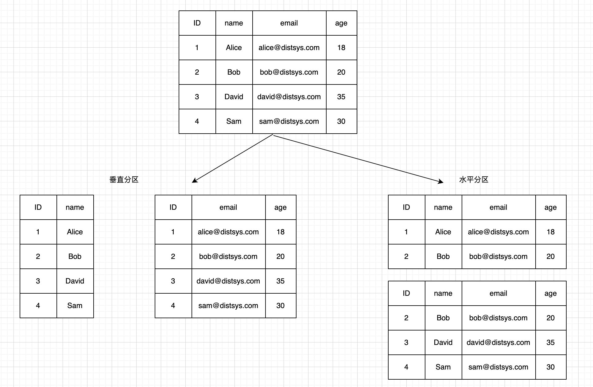

## 分布式数据 - 分区介绍   

>在分布式数据中常见的两个基础技术 -- 分区和复制 

### 分区    
分布式系统带来的主要好处之一是实现了可扩展性，使我们能够存储和处理比单台机器所能容纳的大得多的数据集。实现可扩展性的主要方式之一是对数据进行分区(`Partition`)'。分区是指将一个数据集拆分为多个较小的数据集,同时将存储和处理这些较小数据集的责任分配给分布式系统中的不同节点。数据分区后,我们就可以通过向系统中增加更多节点来增加系统可以存储和处理的数据规模。分区增加了数据的可管理性、可用性和可扩展性。      

`分区分为垂直分区 (Vertical Partitioning)和水平分区 (Horizontal Partitioning)`，这两种分区方式普遍认为起源于关系型数据库，在设计数据库架构时十分常见。下图展示了垂直分区和水平分区的区别。      

          

* 垂直分区是对表的列进行拆分,将某些列的整列数据拆分到特定的分区,并放入不同的表中。垂直分区减小了表的宽度,每个分区都包含了其中的列对应的所有行。`垂直分区也被称为“行拆分 (Row Splitting)”`,因为表的每一行都按照其列进行拆分。例如，可以将不经常使用的列或者一个包含了大 text 类型或 BLOB 类型的列垂直分区，确保数据完整性的同时提高了访问性能。值得一提的是,列式数据库可以看作已经垂直分区的数据库。     

* 水平分区是对表的行进行拆分,将不同的行放入不同的表中,所有在表中定义的列在每个分区中都能找到,所以表的特性依然得以保留。举个简单的例子:一个包含十年订单记录的表可以水平拆分为十个不同的分区,每个分区包含其中一年的记录。     

>列式数据库(Column-Oriented DBMS 或 Columnar DBMS ) 也叫列存数据库,是指以列为单位进行数据存储架构的数据库，主要适用于批量数据处理和即时查询。与之相对应的是行式数据库。一般来说,行式数据库更适用于联机事务处理(OLTP)这类频繁处理事务的场景,列式数据库更适用于联机分析处理(OLAP)这类在海量数据中进行复杂查询的场景。         

垂直分区和列相关,而一个表中的列是有限的,这就导致了垂直分区不能超过一定的限度,而水平分区则可以无限拆分。另外，表中数据以行为单位不断增长,而列的变动很少，因此,水平分区更常见。       

在分布式系统领域,`水平分区常称为分片(Sharding)`。需要说明的是，很多图书和文章会纠结分片和分区的具体区别，一种观点认为,分片意味着数据分布在多个节点上,而分区只是将单个存储文件拆分成多个小的文件,并没有跨物理节点存储。无论是分区还是分片，在分布式架构场景下，两者同等认为数据分布在不同物理机器上。    

分片在不同系统中有着各种各样的称呼,MongoDB 和Elasticsearch 中称为 shard,HBase中称为region,Bigtable 中称为 tablet,Cassandra 和 Riak 中称为 vnode。    
