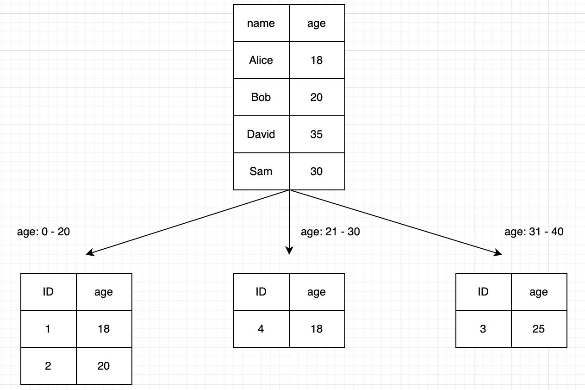
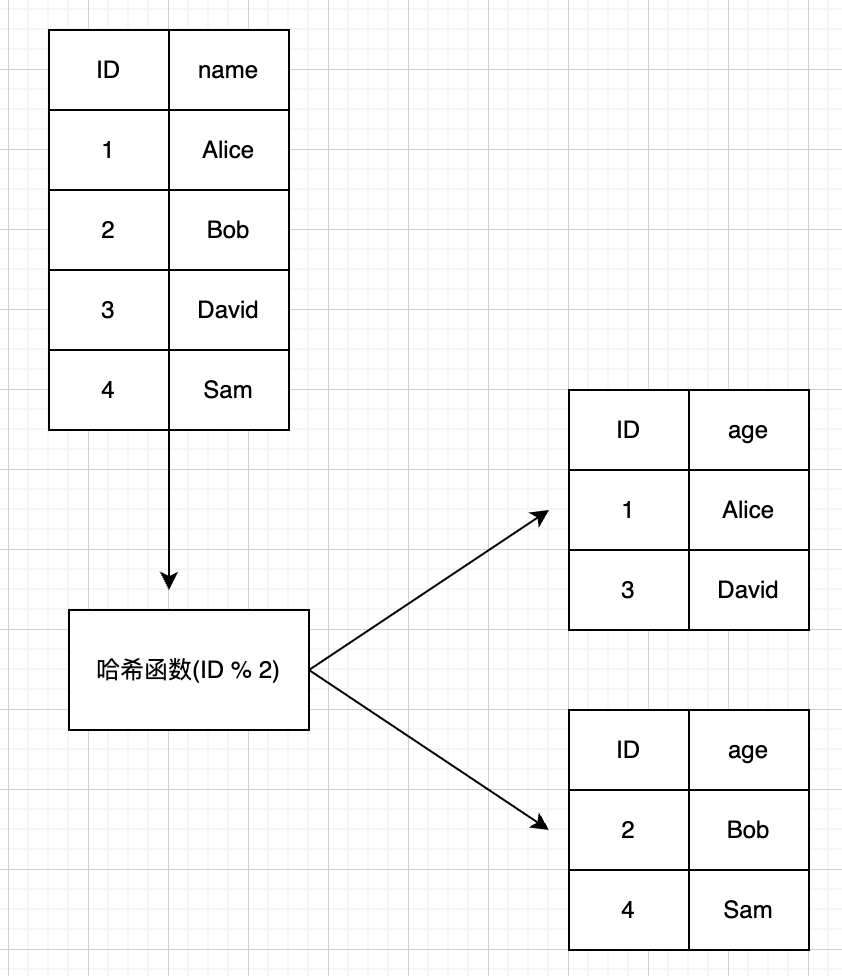
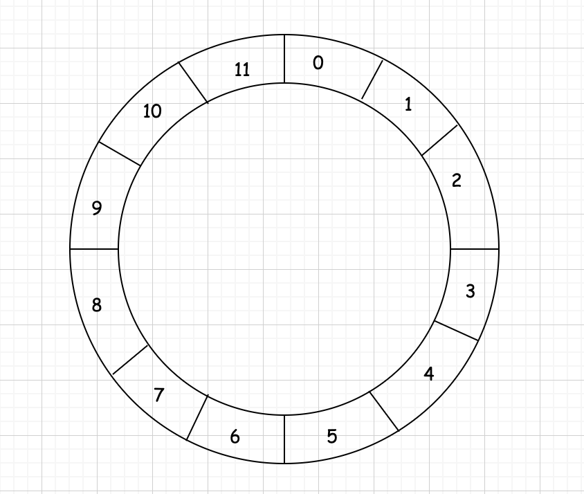
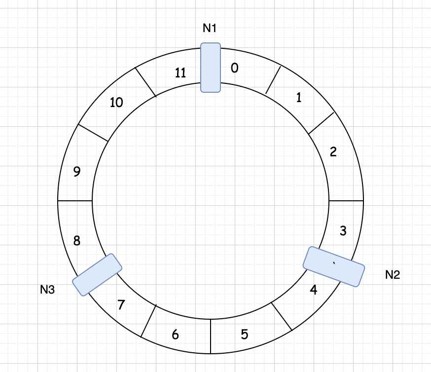
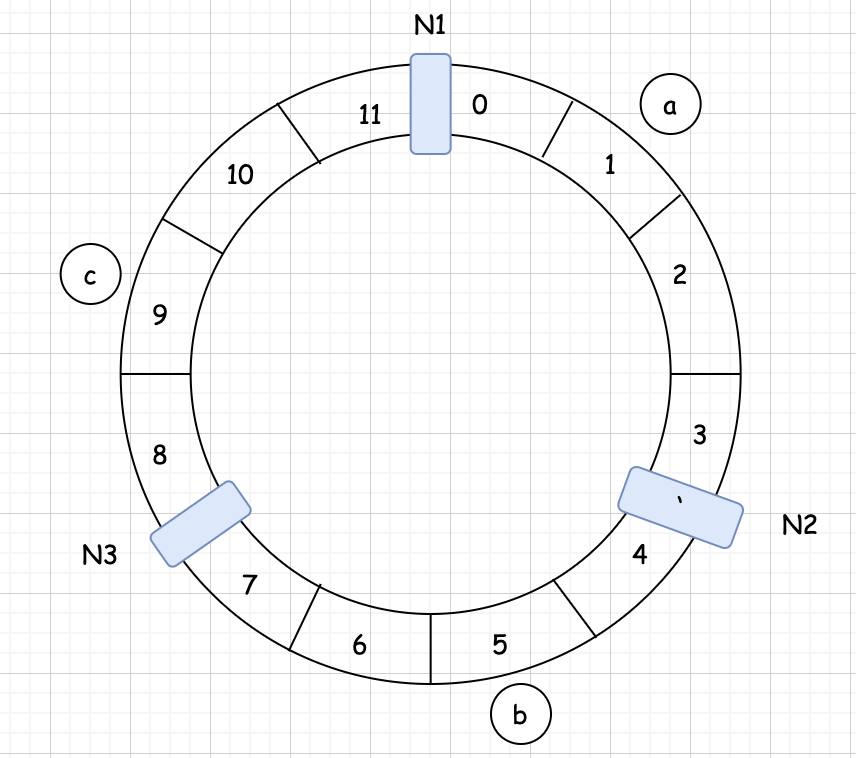
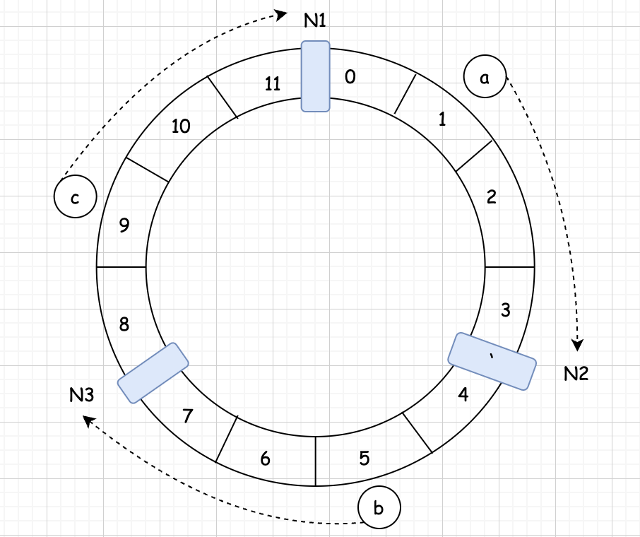
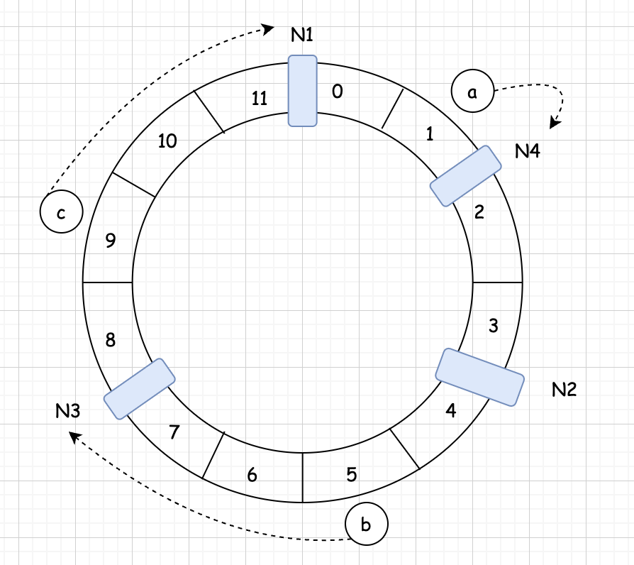
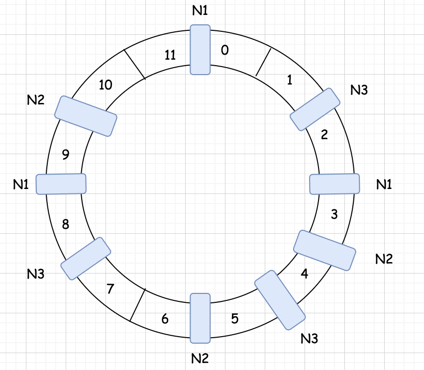

## 分布式数据 水平分区算法    

### 引言    
水平分区算法用来计算某个数据应该划分到哪个分区上,不同的分区算法有着不同的特性。 

本篇我们将研究一些经典的分区算法，讨论每种算法的优缺点。    
为了方便讨论,我们假设数据都是键值对(Key-Value)的组织形式,通常表示为<Key,Value>键值对数据结构可以通过关键字(Key)快速找到值(Value),基本上所有编程语言都内置了基于内存的键值对结构，比如 C++ STL 中的 map、Python 的 dict,以及 Java 的 HashMap,等等。      

### 1.范围分区  
范围分区(Range Partitioning)是指根据指定的关键字将数据集拆分为若干连续的范围,每个范围存储到一个单独的节点上。`用来分区的关键字也叫分区键`。 
下图中的数据可以按年龄进行范围分区： 
  

如何划分范围可以由管理员设定，或者由存储系统自行划分。通常会选择额外的负载均衡节点或者系统中的一个节点来接收客户端请求,然后根据范围分区算法，确定请求应该重定向(路由)到哪个节点或哪几个节点。       
**范围分区的主要优点有:**   
* 实现起来相对简单。    
* 能够对用来进行范围分区的关键字执行范围查询。  
* 当使用分区键进行范围查询的范围较小且位于同一个节点时，性能良好。
* 很容易通过修改范围边界增加或减少范围数据,能够简单有效地调整范围(重新分区),以平衡负载。    

**范围分区的主要缺点有:**   
* 无法使用分区键之外的其他关键字进行范围查询。  
* 当查询的范围较大且位于多个节点时，性能较差。  
* `可能产生数据分布不均或请求流量不均的问题,导致某些数据的热点现象,从而某些节点的负载会很高`。例如，当我们将姓氏作为分区键时,某些姓氏的人非常多(比如姓李或者姓王),这会造成数据分布不均。又例如前面的按年拆分订单的例子，虽然数据分布较为均衡,但根据日常生活习惯,最近一年的订单查询流量可能比前几年的查询流量加起来还要多,这就会造成请求流量不均。总的来说,一些节点可能需要存储和处理更多的数据和请求,一般通过继续拆分范围分区来避免热点问题。           

使用范围分区的分布式存储系统有 Google Bigtable'、Apache HBase和 PingCAP TiKV。范围分区适合那些需要实现范围查询的系统。              

### 2.哈希分区      
哈希分区 (Hash Partitioning)的策略是将指定的关键字经过一个哈希函数的计算，根据计算得到的值来决定该数据集的分区,如下图所示。     
  

哈希分区的优点是，数据的分布几乎是随机的,所以分布相对均匀，能够在一定程度上避免热点问题。       
哈希分区的缺点是:
* 在不额外存储数据的情况下,无法执行范围查询。       
* 在添加或删除节点时,由于每个节点都需要一个相应的哈希值,所以`增加节点需要修改哈希函数,这会导致许多现有的数据都要重新映射,引起数据大规模移动`。并且在此期间，系统可能无法继续工作。    

### 3.一致性哈希    
一致性哈希 (Consistent Hashing) 是一种特殊的哈希分区算法,在分布式存储系统中用来缓解哈希分区增加或删除节点时引起的大规模数据移动问题。   
一致性哈希算法将整个哈希值组织成一个抽象的圆环,称为哈希环(Hashing Ring)。哈希函数的输出值一般在0到INT MAX(通常为 2的32次方 - 1) 之间, 这些输出值可以均匀地映射到哈希环边上。举个例子，假设哈希函数 hash()的输出值大于/等于0 小于/等于 11,那么整个哈希环看起来如下图所示。       

     

接下来将分布式系统的节点映射到圆环上。假设系统中有三个节点N1、N2 和N3,系统管理员可以通过机器名称或 IP 地址将节点映射到环上,假设节点分布到哈希环上,如下图所示。   

  

接着,将需要存储的数据的关键字输入哈希函数,计算出哈希值,根据哈希值将数据映射到哈希环上。假设此时要存储三个键值对数据,它们的关键字分别为ab和c，假设经过哈希函数计算后的哈希值分别为15 和 9,则数据映射到环上后如图 3-6 所示。

          

那么数据具体分区到哪个节点上呢? 在一致性哈希算法中,数据存储在按照顺时针方向遇到的第一个节点上。如下图,关键字a顺时针方向遇到的第一个节点是 N2,所以a存储在节点N2上;同理, 关键字b存储在节点 N3 上,关键字c存储在节点 N1 上。数据分布方法如下图所示。        

  

接下来我们继续看一下,向集群中添加一个节点会发生什么。假设集群此时要添加一个节点 N4,并添加到如下图所示的哈希环位置。那么,按照顺时针计算的方法,原本存储到节点N2 上的关键字a将转移到 N4 上,其他数据保持不动。      

  

可见,相比于普通的哈希分区添加或删除节点时会导致大量映射失效,一致性哈希很好地处理了这种情况。对于添加一台服务器这种情况,受影响的仅仅是新节点在哈希环上与相邻的另一个节点之间的数据,其他数据并不会受到影响。例如上图中,只有节点 N2 上的一部分数据会迁移到节点 N4,而节点 N1 和 N3 上的数据不需要进行迁移。     

一致性哈希对于节点的增减只需要重新分配哈希环上的一部分数据,改善了哈希分区大规模迁移的缺点。此外，一致性哈希也不需要修改哈希函数,直接将新节点指定到哈希环上的某个位置即可。相比简单的哈希分区,一致性哈希有着更好的可扩展性和可管理性。       

但是，`一致性哈希仍然有明显的缺点`,当系统节点太少时,还是容易产生数据分布不均的问题。另外，一个较为严重的缺点是，当一个节点发生异常需要下线时，该节点的数据全部转移到顺时针方向的节点上,从而导致顺时针方向节点存储大量数据,大量负载会倾斜到该节点。      

解决这个问题的方法是引入虚拟节点(VirtualNode),虚拟节点并不是真实的物理服务器,虚拟节点是实际节点在哈希环中的副本,一个物理节点不再只对应哈希环上一个点，而是对应多个节点。我们假设一个物理节点要映射到哈希环中的三个点，引入虚拟节点后的哈希环如下图所示。可以很直观地发现,虚拟节点越多,数据分布就越均匀。当节点发生异常被迫下线时,数据会分摊给其余的节点,避免某个节点独自承担存储和处理数据的压力。  

      

如果系统中有不同配置、不同性能的机器,那么虚拟节点也很有用。例如，系统中有一台机器的性能是其他机器的两倍,那么我们可以让这台机器映射出两倍于其他机器的节点数,让它来承担更多的负载。       

不过，在不额外存储数据的情况下，一致性哈希依然无法高效地进行范围查询。任何范围查询都会发送到多个节点上。
使用一致性哈希的典型的分布式数据存储系统有 Dynamo 和 Apache Cassandra。     

### 分区的挑战  
虽然分区有助于让系统高效地处理较大的数据集,并且易于扩展，但也带来了一些限制。在一个垂直分区的数据集中,将不同表的数据组合起来的查询(即join 查询)会非常低效,因为这些请求可能需要访问多个节点的数据。这种情况在水平分区的系统中可以避免，因为每-行的所有数据都位于同一个节点中。但是，`对于需要查询许多行的范围查询来说，可能这些行位于不同的节点，请求也会访问多个节点`。       

`分区的另一个挑战是实现事务,数据存储在单台机器上时实现事务的难度尚可`，但在分布式系统中想要实现事务就比较困难，这一点我们后续会在“分布式事务”中详细讨论。           