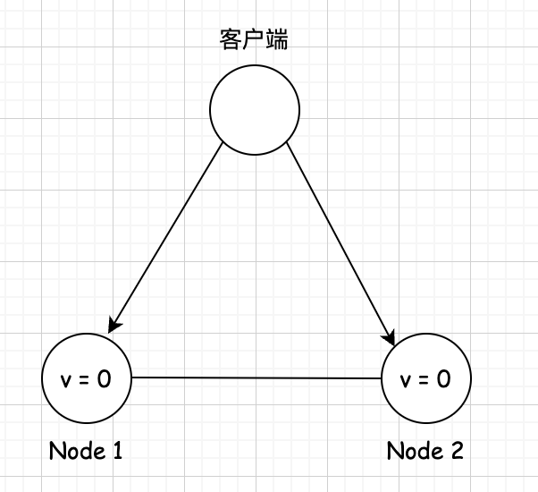
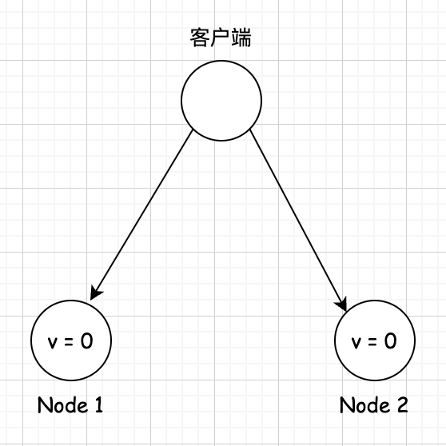
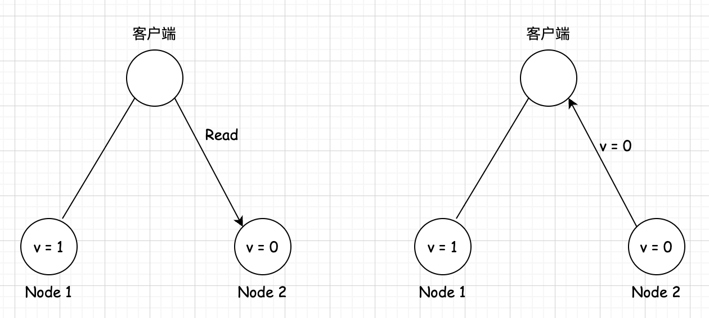

## CAP 定理 

### 介绍        
CAP 定理就是一个分布式系统特性的高度抽象,它总结了各个特性之间的冲突。分区和复制等技术既会带来好处,也会带来问题,CAP 定理对这类数据系统的特性做了一个重要的总结。     

CAP定理也叫布鲁尔定理(Brewer's Theorem),是2000 年由加州大学伯克利分校(UniversityofCalifornia,Berkeley)的计算机科学家埃里克·布鲁尔(Eric Brewer)在分布式计算原理研讨会 (PODC)上提出的一个猜想"。虽然当时就命名为“CAP 定理”,但还未被证实。         

两年后，麻省理工学院的 Seth Gilbert 和 Nancy Lynch 教授证明了布鲁尔的猜想?,CAP 定理正式诞生。CAP 定理指出在一个异步网络环境中,对于一个分布式读写存储(Read-Write Storage) 系统来说,只能满足以下三项中的两项,而不可能满足全部三项:            
* 一致性 (Consistency)。        
* 可用性 (Availability)。       
* 分区容错性 (Partition Tolerance)。            

一致性可以这么理解,客户端访问所有节点,返回的都是同一份最新的数据。可用性是指,每次请求都能获取非错误的响应,但不保证获取的数据是最新数据。分区容错性是指，节点之间由于网络分区而导致消息丢失的情况下，系统仍能继续正常运行。`需要强调的是，这里的一致性是指线性一致性`。这里读者只需要理解为,对于单个对象,读操作会返回最近一次写操作的结果，这也叫线性一致性读。              

为了便于理解，举一个具体的例子。考虑一个非常简单的分布式系统,它由两台服务器Node1 和 Node2 组成,这两台服务器都存储了同一份数据的两个副本,我们可以简单认为这个数据是一个键值对，初始的记录为 v=0。服务器 Node1 和 Node2 之间能够互相通信,并且都能与客户端通信。这个例子如下图所示。 

      

现在客户端向 Nodel 发送写请求 v=1。如果 Nodel 收到写请求后,只将自己的V值更新为1,然后直接向客户端返回写入成功的响应,这时 Node2 的  值还是等于 0,此时客户端如果向Node2 发起了读的请求,读到的将是旧的值 0。那么,此时这两个节点是不满足一致性的。       

如果 Nodel 先把 v=1 复制给 Node2,再返回客户端,那么此时两个节点的数据就是一致的。这样,无论客户端从哪个节点读取值,都能读到最新的值 1。此时系统满足一致性 。       

接下来的`可用性`和`分区容错性`就比较好理解了。`可用性就是说,客户端向其中一个节点发起一个请求,且该节点正常运行无故障,那么这个节点最终必须响应客户端的请求`。         

`分区容错性是指，当节点间出现网络分区的时候,系统仍然可以正常提供服务。`     

为什么 CAP 定理说一个系统不能同时满足一致性、可用性和分区容错性?这里给出简要的证明。            

我们使用反证法证明。假设存在一个同时满足这三个属性的系统,我们第一件要做的事情就是让系统发生网络分区，就像下图中的情况一样,服务器 Node1 和 Node2 之间的网络发生故障导致断开连接。            

      

客户端向 Node1 发起写请求,将的值更新为 1,因为系统是可用的,所以Node1 必须响应客户端的请求，但是由于网络分区,Node1 无法将其数据复制到 Node2,如下图所示。      

      

接着,客户端向服务器 Node2 发起读 V 的请求,再一次因为系统是可用的,所以 Node2 必须响应客户端的请求。还是因为网络分区, Node2 无法从 Node1 更新 V 的值,所以 Node2 返回给客户端的是旧的值0,和客户端刚才写入的了的值不同,如下图所示。     

  

这显然违背了一致性,因此证明不存在这样的系统。       
`CAP 定理的重要意义在于,它帮助软件工程师在设计分布式系统时，施加基本的限制,不必浪费时间去构建一个完美的系统`。软件工程师应该意识到这些特性需要进行取舍，进而选择适合的特性来开发分布式系统。        

对于一个分布式系统来说，节点之间是通过网络通信的，只要有网络，必然出现消息延迟或丢失，网络分区故障是必然发生的，所以分区容忍性是一个基本的要求。CAP定理就是用来探讨在这种情况下，在系统设计上必须做出的取舍。因此，开发者通常将他们的分布式系统分为2类,即CP或AP,这取决于在保证分区容错性(P)的情况下选择一致性(C)还是可用性(A)。 

虽然 CAP 定理在如今颇受争议且遭受一些批评,但笔者认为CAP 定理仍然是一个很好的思想框架,能够辅助架构师进行思考,帮助架构师在多种多样的方案中设计出符合自身需求的系统。事实上，过去几年许多分布式系统仍然使用CAP 定理来描述自身系统类型。        

2012 年,Eric Brewer 在一篇名为“CAP 理论十二年回顾:“规则’变了 (CAPtwelve yearslater: How the'rules' have changed)”的文章中回顾了 CAP 定理容易产生的一些误解。首先，文章指出,“三选二”公式存在误导性,其实由于网络分区很少发生,那么在系统不存在网络分区的时候,没有什么理由牺牲一致性或可用性,这两个特性都可以满足。只有在网络分区期间，才需要在一致性和可用性之间做出选择。     

其次,系统在正常运行的过程中,虽然没有网络分区发生,但网络延迟还是会存在。而CAP定理的经典解释是忽略网络延迟的,但在实际中延迟和分区紧密相关。系统在出现网络延迟的时候，如果选择放弃处理请求,则相当于降低了可用性;如果选择继续处理请求，由于延迟存在，则会降低系统的一致性。系统需要在网络延迟时做出权衡。           

这种权衡的一个例子是我们之前描述的单主复制方案，在延迟存在的情况下，是选择同步复制倾向于系统的一致性,还是选择异步复制让系统可用性更高呢?本章提及的很多内容都伴随着这样的思考和取舍。            

