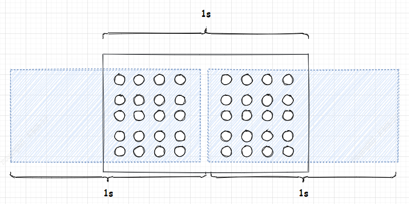

# 限流算法

>限流常用的四种算法：计数法、滑动窗口、漏桶算法和令牌桶算法

## 计数法
一种简单的限流算法就是给出一个单位时间，然后使用一个计数器counter统计单位时间内收到的请求数量，当请求数量超过门限时，余下的请求丢弃或者等待。
`这种简单的算法有一个严重的问题: 就是很难控制边界时间上的请求。假设时间单位是1秒，每秒请求不超过10个。如果在这一秒的前半秒没有请求，而后半秒有10个请求，下一秒的前半秒又有10个请求，那么在这中间的一秒内，就会合理处理20个请求，而这明显违反了限流的基本需求。这是一种简单粗暴的总数量限流而不是平均限流` 

## 漏桶算法
利用一个缓存区，当有请求进入系统时，无论请求的速率如何，都先在缓存区内保存，然后以固定的流速流出缓存区进行处理，如图3.4所示。漏桶算法的特点是无论外部请求压力如何，漏桶算法总是以固定的流速处理数据。漏桶的容积和流出速率是该算法的两个重要参数

## 令牌桶算法
令牌桶算法是一种反向的漏桶算法。在令牌桶算法中，桶中存放的不再是请求，而是令牌。处理程序只有拿到令牌后，才能对请求进行处理。如果没有令牌，那么处理程序要么丢弃请求，要么等待可用的令牌。为了限制流速，该算法在每个单位时间产生一定量的令牌存入桶中。比如，要限定应用每秒只能处理1个请求，那么令牌桶就会每秒产生1个令牌。通常，桶的容量是有限的，比如，当令牌没有被消耗掉时，只能累计有限单位时间内的令牌数量

## Guava RateLimiter

>参考 《实战Java高并发程序设计》