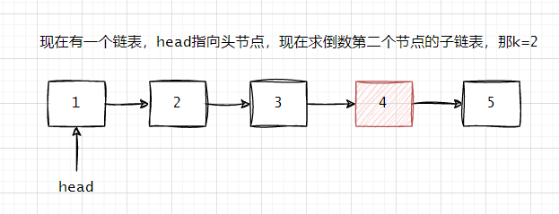
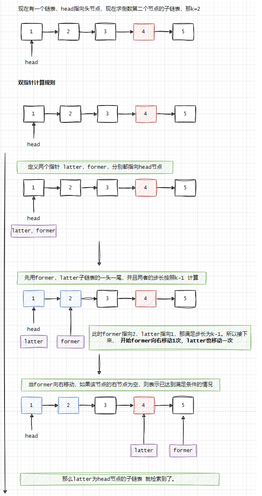

## 链表中倒数第k个节点  

>LeetCode 22    

### 原题介绍    
请参考: https://leetcode.cn/problems/lian-biao-zhong-dao-shu-di-kge-jie-dian-lcof/description/  

### 案例    
现在有一个链表，head指向头节点，现在求倒数第二个节点的`子链表`，那k=2， 如下图所示：  

    

当k=2时，那么求得子链表的步长是k-1=1。 

该题，要是在平时开发中，估计博主早就用size()或者length() API，获取链表长度，然后再从head遍历一次直到找到与最后一个节点之间步长为k-1的节点即可。 还有另一种解法`双指针`。    

**双指针规则处理的过程**    

    

