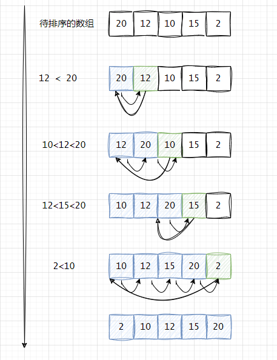

## 插入排序（Insertion Sort）

### 定义
插入排序，一般也被称为直接插入排序。对于少量元素的排序，它是一个有效的算法。它的基本思路是将一个记录插入到已经排好序的有序表中，从而一个新的、记录数增1的有序表。在其实现过程使用双层循环，外层循环对除了第一个元素之外的所有元素，内层循环对当前元素前面有序表进行待插入位置查找，并进行移动。


### 排序过程


```java
public class InsertionSort {

    public static void main(String[] args) {
        int[] nums = {20, 12, 10, 15, 2};

        insertionSort(nums);
        String result = Arrays.stream(nums).mapToObj(String::valueOf)
                .collect(Collectors.joining(","));
        System.out.println(result);
    }

    public static void insertionSort(int[] array) {
        int n = array.length;
        for (int i = 1; i < n; ++i) {
            int key = array[i]; // 将判断的值先从copy，
            int j = i - 1;

            // Move elements of array[0..i-1], that are
            // greater than key, to one position ahead
            // of their current position
            while (j >= 0 && array[j] > key) {
                array[j + 1] = array[j];
                j = j - 1;
            }
            array[j + 1] = key;
        }
    }

}
```

总得来说，插入排序对部分有序的数组十分高效，也适合小规模数组。这很重要。因为这些类型的数组在实际应用中经常出现，而且它们也是高级趴排序算法的中间过程。

