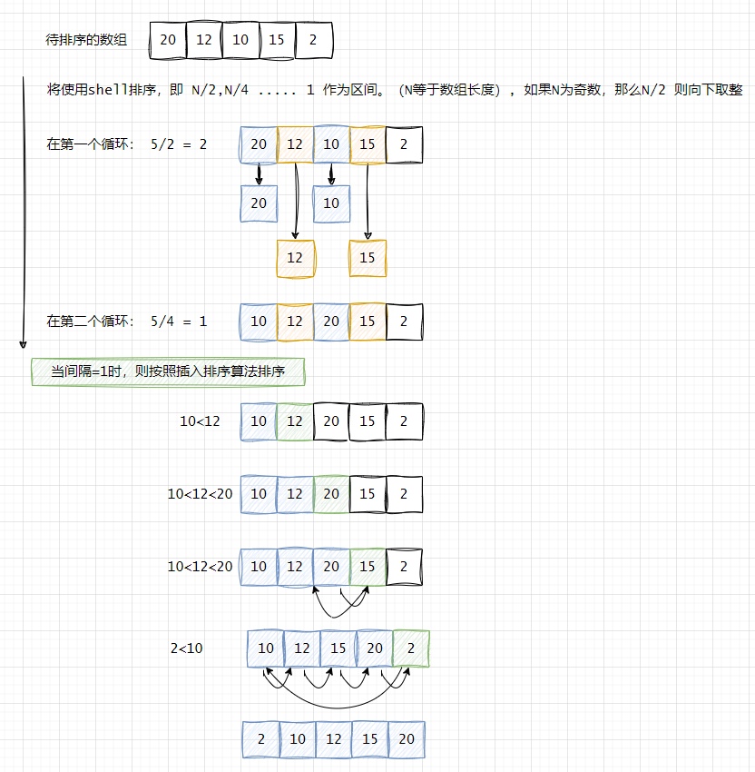

## 希尔排序（Shell Sort）

### 定义
希尔排序是插入排序的一种又称“缩小增量排序”（Diminishing Increment Sort），是直接插入排序算法的一种更高效的改进版本。希尔排序是非稳定排序算法。希尔排序是把记录按下标的一定增量分组，堆每组使用直接插入排序算法排序；随着增量主键减少，每组包含的关键词越来越多，当增量减至1时，整个文件恰被分成一组，算法便终止。

为了展示初级排序算法性质的价值，希尔排序是一种基于插入排序的快速的排序算法。`对于大规模乱序数组插入排序很慢，因为它只会交换相邻的元素，因此元素只能一点一点地从数组的一端移动到另一端`。例如，如果主键最小的元素正好在数组的尽头，要将它挪到正确的位置就需要N-1次移动。希尔排序为了加快速度简单地改进了插入排序，交换不相邻的元素以对数组的局部进行排序，并最终用插入排序将局部有序的数组排序。 

希尔排序的思想是使数组中任意间隔为h的元素都是有序的。这样的数组被称为h有序数组。换句话说，一个h有序数组就是h个互相独立的有序数组编织在一起组成的一个数组。在进行排序时，如果h很大，我们就能将元素移动到很远的地方，为实现更小的h有序创造方便。用这种方式，对于任意以1结尾的h序列，我们都能够将数组排序。这就是希尔排序。    


### 排序过程



```java
public class ShellSort {
    public static void main(String[] args) {
        int[] nums = {20, 12, 10, 15, 2};

        shellSort(nums);
        String result = Arrays.stream(nums).mapToObj(String::valueOf)
                .collect(Collectors.joining(","));
        System.out.println(result);
    }

    public static void shellSort(int[] array) {
        int n = array.length;

        // Start with a big gap, then reduce the gap
        for (int gap = n / 2; gap > 0; gap /= 2) {
            // Do a gapped insertion sort for this gap size.
            // The first gap elements a[0..gap-1] are already in gapped order
            // keep adding one more element until the entire array is gap sorted
            for (int i = gap; i < n; i += 1) {
                // add a[i] to the elements that have been gap sorted
                // save a[i] in temp and make a hole at position i
                int temp = array[i];

                // shift earlier gap-sorted elements up until the correct location for a[i] is found
                int j;
                for (j = i; j >= gap && array[j - gap] > temp; j -= gap) {
                    array[j] = array[j - gap];
                }

                // put temp (the original a[i]) in its correct location
                array[j] = temp;
            }
        }
    }
}
```

和选择排序以及插入排序对比，希尔排序也可以用于大型数组，它对任意排序（不一定是随机的）的数组表现也很好。实际上，对于一个给定的递增序列，构建一个使希尔排序运行缓慢的数组并不容易。 它的代码量小且不需要使用`额外的内存空间`。如果你需要解决一个排序问题而又没有系统排序函数可用，可以先用希尔排序，然后再考虑是否值得将它替换为更加复杂的排序算法。 
