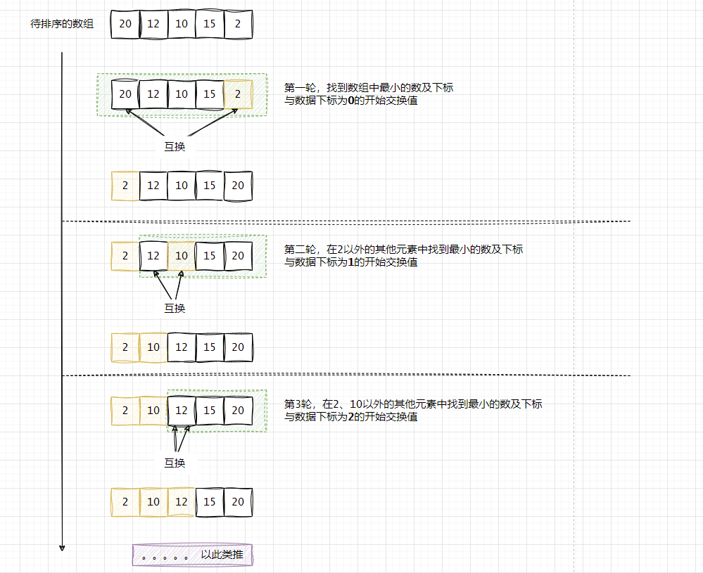

## 选择排序（Selection Sort）

### 定义
`选择排序`是一种最简单的排序算法，首先找到数组中最小的那个元素，其次，将它和数组的第一个元素交换位置（如果第一个元素就是最小元素那么它就和自己交换）。再次，再剩下的元素中找到最小的元素，将它与数组的第二个元素交换位置。如此往复，直到将整个数组排序。


### 排序过程




**Java实现选择排序**
```java
public class SelectionSort {
    public static void main(String[] args) {
        int nums[] = {20,12,10,15,2};
        selectionSort(nums);
        String result = Arrays.stream(nums).mapToObj(String::valueOf)
                .collect(Collectors.joining(","));
        System.out.println(result);
    }

    public static void selectionSort(int[] nums) {
        int n = nums.length;
        int temp;// 临时变量
        for (int i = 0; i < n - 1; i++) {
            for (int j = i + 1; j < n; j++) {
                if (nums[i] > nums[j]) {
                    temp = nums[i];
                    nums[i] = nums[j];
                    nums[j] = temp;
                }
            }
        }
    }
}
```


总的来说，选择排序是一种很容易理解和实现的简单排序算法，它有两个很鲜明的特点。  

**运行时间和输入无关** 为了找出最小的元素而扫描一遍数组并不能为下一遍扫描提供什么信息。这种性质在某些情况下是缺点，因为使用选择排序的人可能会惊讶地发现，一个已经有序的数组或是主键全部相等的数组和一个元素随机排列的数组所用的排序时间竟然一样长!我们将会看到，其他算法会更善于利用输入的初始状态。    

**数据移动是最少的** 每次交换都会改变两个数组元素的值，因此选择排序用了N次交换—-交换次数和数组的大小是线性关系。我们将研究的其他任何算法都不具备这个特征（大部分的增长数量级都是线性对数或是平方级别)。    
