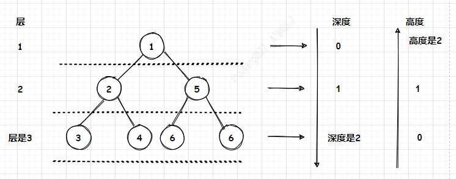

**`正文`**

[TOC]

`树图`



## 二叉树
二叉树(Binary tree) 是每个节点最多只有两个分支(即不存在分支度大于2的节点)的树结构。通常分支被称作 "左子树" 或 "右子树"。二叉树的分支具有左右次序，不能随意颠倒。
二叉树的第i层至多拥有2^(i-1)个节点；深度为k的二叉树至多总共有2^k -1个节点(定义根节点所在深度k0 = 0),而总计拥有节点数匹配，称为"满二叉树"；
深度为k有n个节点的二叉树，当且仅当其中的每一个节点，都可以和同样深度k的满二叉树，序号为1到n的节点一对一对应时，称为完全二叉树。
对任何一颗非空的二叉树T，如果其叶片(终端节点)数为n0,分支度为2的节点数为n2，则n0 = n2 +1;


## 二叉树遍历方法
二叉树的遍历(traversing binary tree) 是指从根结点出发，按照某种次序依次访问二叉树中所有结点，使得每个结点被访问一次且仅被访问一次。

1. 前(先)序、中序、后序遍历  
`对描述还不理解，请参照代码，在脑海中debug下代码流程`
遍历二叉树:L、D、R分别表示遍历左子树、访问根节点和遍历右子树，则先序遍历二叉树的顺序是DLR，中序遍历二叉树的顺序是LDR，后序遍历二叉树的顺序是LRD，还有按层遍历二叉树。 这些方法的时间复杂度都是O(n),n为节点个数。

* 先序遍历：规则是若二叉树为空，则空操作返回，否则先访问根结点，然后前序遍历左子树，再前序遍历右子树。


遍历顺序为：ABDGHCEIF

```c++
//二叉树的前序遍历递归算法
void PreOrderTraverse(BiTree T){
    if(T==NULL){
        return;
    }
    printf("%c",T->data); //显示结点数据
    PreOrderTraverse(T->lchild); //再先先序遍历左子树
    PreOrderTraverse(T->rchild); //最后先序遍历右字数
}
```

* 中序遍历：规则是若树为空，则空操作返回，否则从根结点开始(注意并不是先访问根结点)，中序遍历根结点的左子树，然后是访问根结点，最后中序遍历右子树。


遍历顺序为：GDHBAEICF

```c++
//二叉树的中序遍历递归算法
void InOrderTraverse(BiTree T){
    if(T==NULL){
        return;
    }
    InOrderTraverse(T->lchild); //中序遍历左子树
    printf("%c",T->data); //显示结点数据
    InOrderTraverse(T->rchild); //最后中序遍历右子树
}
```

* 后序遍历：规则是若树为空，则空操作返回，否则从左到右先叶子后结点的方式遍历访问左右子树，最后是访问根结点。


遍历顺序为：GHDBIEFCA

```c++
//二叉树的后序遍历递归算法
void PostOrderTraverse(BiTree T){
    if(T==NULL){
        return;
    }
    PostOrderTraverse(T->lchild); //先后序遍历左子树
    PostOrderTraverse(T->rchild); //再后序遍历右子树
    printf("%c",T->data); //显示结点数据
}
```


* 层次遍历：规则是若树为空，则空操作返回，否则从树的第一层，也就是根结点开始访问，从上而下逐层遍历，在同一层中，按从左到右的顺序对结点逐个访问。


遍历顺序为：ABCDEFGHI


## 线索二叉树
>参考：《大话数据结构》 6.10.1 线索二叉树原理

1. 产生背景
现有一棵结点数目为n的二叉树，采用二叉链表的形式存储。对于每个结点均有指向左右孩子的两个指针域，而结点为n的二叉树一共有n-1条有效分支路径。那么，则二叉链表中存在2n-(n-1)=n+1个空指针域。那么，这些空指针造成了空间浪费。
下图所示一棵二叉树一共有10个结点，空指针^有11个。

此外，当对二叉树进行中序遍历时可以得到二叉树的中序序列。图中二叉树的中序遍历结果为HDIBJEAFCG，可以得知A的前驱结点为E，后继结点为F。但是，这种关系的获得是建立在完成遍历后得到的，那么可不可以在建立二叉树时就记录下前驱后继的关系呢，那么在后续寻找前驱结点和后继结点时将大大提升效率

2. 线索化
现将某结点的空指针域指向该结点的前驱后继，定义规则如下：
* 若结点的左子树为空，则该结点的左孩子指针指向其前驱结点。
* 若结点的右子树为空，则该结点的右孩子指针指向其后继结点。
这种指向前驱和后继的指针称为线索。将一棵普通二叉树以某种次序遍历，并添加线索的过程称为线索化。

3. 还有问题？
我们如何知道某一节点的lchild是指向它的左孩子还是指向前驱？rchild是指向右孩子还是指向后继？比如E结点的lchild是指向它的左孩子J，而rchild却是指向它的后继A。显然我们在决定lchild是指向左孩子还是前驱，rchild是指向右孩子还是后继上是需要一个区分标记的。因此，我们再每个结点再增设两个标志域ltag和rtag，注意ltag和rtag只是存放0或1数字的布尔型变量，其占用的内存空间要小于像lchild和rchild的指针变量。结点结构如下：

其中:
* ltag为0时指向该结点的左孩子，为1时指向该结点的前驱。
* rtag为0时指向该结点的右孩子，为1时指向该结点的后继。


参考：《大话数据结构》