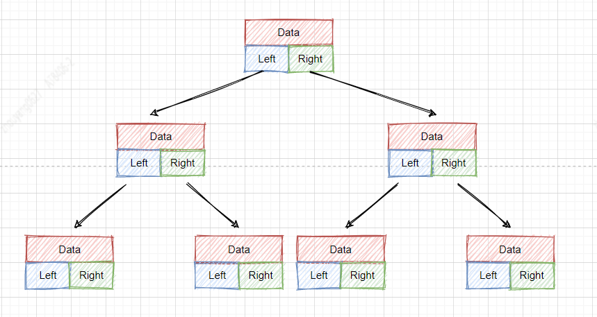
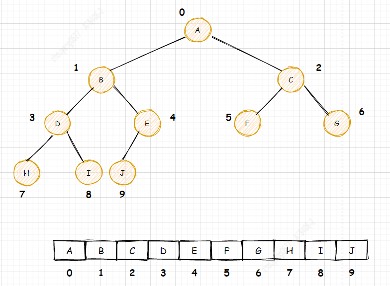
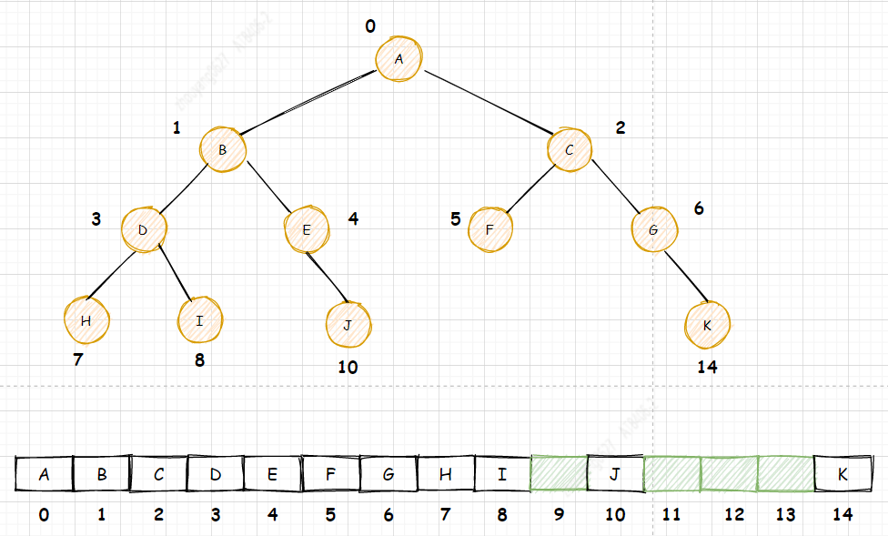

--In Blog
--Tags: 数据结构与算法
--CreateTime: 2021-01-18 00:11:00

`树图`


## 1. 二叉树
二叉树(Binary tree) 是每个节点最多只有两个分支(即不存在分支度大于2的节点)的树结构。通常分支被称作 "左子树" 或 "右子树"。二叉树的分支具有左右次序，不能随意颠倒。
* 二叉树的第i层至多拥有2^(i-1) 个节点；
* 深度为k的二叉树至多总共有2^k -1个节点(定义根节点所在深度k0 = 0),而总计拥有节点数匹配，称为"满二叉树"
* 深度为k有n个节点的二叉树，当且仅当其中的每一个节点，都可以和同样深度k的满二叉树，序号为1到n的节点一对一对应时，称为完全二叉树
* 对任何一颗非空的二叉树T，如果其叶片(终端节点)数为n0,分支度为2的节点数为n2，则n0 = n2 +1;

## 2. 满二叉树
在二叉树中，除最下一层的叶节点外，每层的节点都有两个子节点。       
特征：`深度为k且有2^k-1个结点的二叉树`


## 3. 完全二叉树
除二叉树最后一层外，其他各层的节点数都达到最大个数，且最后一层从左向右的叶节点连续存在，只缺右侧若干节点。  
特征：`当二叉树的深度为h时，它的h层节点必须都是连续靠左并不可隔开的(满二叉树也符合)，并且1～h-1层的结点数都达到最大个数(即1~h-1层为一个满二叉树)`


## 4. 二叉树遍历方法
二叉树的遍历(traversing binary tree) 是指从根结点出发，按照某种次序依次访问二叉树中所有结点，使得每个结点被访问一次且仅被访问一次。

`深度优先遍历`

### 前(先)序、中序、后序遍历  
`对描述还不理解，请参照代码，在脑海中debug下代码流程`
遍历二叉树:L、D、R分别表示遍历左子树、访问根节点和遍历右子树，则先序遍历二叉树的顺序是DLR，中序遍历二叉树的顺序是LDR，后序遍历二叉树的顺序是LRD，还有按层遍历二叉树。 这些方法的时间复杂度都是O(n),n为节点个数。

* 先序遍历：规则是若二叉树为空，则空操作返回，否则先访问根结点，然后前序遍历左子树，再前序遍历右子树。


遍历顺序为：ABDGHCEIF

```java
/**
    * 前序遍历
    */
public void preOrderTraverse() {
    System.out.println(this); //先输出父结点
    //递归向左子树前序遍历
    if (this.left != null) {
        this.left.preOrderTraverse();
    }
    //递归向右子树前序遍历
    if (this.right != null) {
        this.right.preOrderTraverse();
    }
}
```

* 中序遍历：规则是若树为空，则空操作返回，否则从根结点开始(注意并不是先访问根结点)，中序遍历根结点的左子树，然后是访问根结点，最后中序遍历右子树。


遍历顺序为：GDHBAEICF

```java
/**
    * 中序遍历
    */
public void inOrderTraverse() {
    //递归向左子树中序遍历
    if (this.left != null) {
        this.left.inOrderTraverse();
    }
    //输出父结点
    System.out.println(this);
    //递归向右子树中序遍历
    if (this.right != null) {
        this.right.inOrderTraverse();
    }
}
```

* 后序遍历：规则是若树为空，则空操作返回，否则从左到右先叶子后结点的方式遍历访问左右子树，最后是访问根结点。


遍历顺序为：GHDBIEFCA

```java
/**
    * 后序遍历
    */
public void postOrderTraverse() {
    if (this.left != null) {
        this.left.postOrderTraverse();
    }
    if (this.right != null) {
        this.right.postOrderTraverse();
    }
    System.out.println(this);
}
```


* 层次遍历：规则是若树为空，则空操作返回，否则从树的第一层，也就是根结点开始访问，从上而下逐层遍历，在同一层中，按从左到右的顺序对结点逐个访问。


遍历顺序为：ABCDEFGHI

## 5. 二叉树的存储
想要存储一颗二叉树，有两种实现方法，一种是基于引用(Java)/指针(C)的二叉树存储，另一种是基于数组的顺序存储。

### 5.1 基于引用/指针的二叉树存储
**结构图**      

从上图中可以看出每个节点有三个字段，`Data`用于存储数据,`Left`、`Right`用于指向左右子节点的引用/指针。所以只要知晓根节点，就可以通过左右子节点的引用/指针。  
提供参考学习代码: [基于引用/指针的二叉树存储](https://github.com/xinzhuxiansheng/javamain-services/blob/main/javamain-algorithms/src/main/java/com/javamain/algorithms/tree/binarytreebasicref/BinaryTreeBasicRef.java)


### 5.2 基于数组的顺序存储
**结构图**  
  
基于数组的顺序存储，为了方便计算左右子节点的下标，将根节点A存储的下标i=0的位置，那左子节点存储在下标`2*i+1`的位置，右子节点存储在`2*i+2`的位置。
>上面结构图是一颗完全二叉树，没有浪费存储空间，那如果是非完全二叉树，用同样的左右子节点下标计算公式，会浪费比较多的数组存储空间。      

  

提供参考学习代码: [基于引用/指针的二叉树存储](https://github.com/xinzhuxiansheng/javamain-services/blob/main/javamain-algorithms/src/main/java/com/javamain/algorithms/tree/binarytreebasicarray/BinaryTreeBasicArray.java)

在存储空间来看，很多情况下的非完全二叉树的存储实现是基于引用/指针方法。


>参考：《大话数据结构》