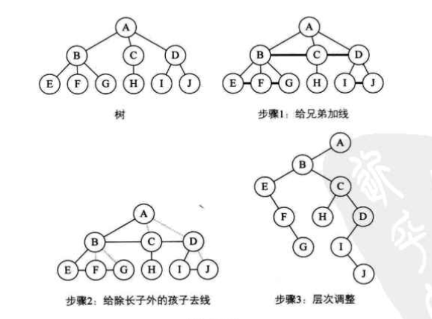

**正文**

[TOC]

## 树转换为二叉树
将树转换为二叉树的步骤如下
1. 加线,在所有兄弟结点之间加一条连线
2. 去线,对树中每个结点，只保留它与第一个孩子结点的连线，删除它与其他孩子结点之间的连线。
3. 层次调整，以树的根结点为轴心，将整棵树顺时针旋转一定的角度，使之结构层次分明，注意第一个孩子是二叉树结点的左孩子，兄弟转换过来的孩子是结点的右孩子。

一棵树经过三个步骤转换为一颗二叉树：
