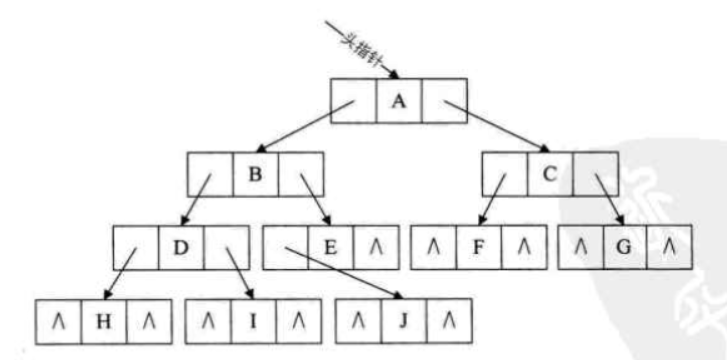

## 线索二叉树
>参考：《大话数据结构》 6.10.1 线索二叉树原理

1. 产生背景
现有一棵结点数目为n的二叉树，采用二叉链表的形式存储。对于每个结点均有指向左右孩子的两个指针域，而结点为n的二叉树一共有n-1条有效分支路径。那么，则二叉链表中存在2n-(n-1)=n+1个空指针域。那么，这些空指针造成了空间浪费。
下图所示一棵二叉树一共有10个结点，空指针^有11个。

此外，当对二叉树进行中序遍历时可以得到二叉树的中序序列。图中二叉树的中序遍历结果为HDIBJEAFCG，可以得知A的前驱结点为E，后继结点为F。但是，这种关系的获得是建立在完成遍历后得到的，那么可不可以在建立二叉树时就记录下前驱后继的关系呢，那么在后续寻找前驱结点和后继结点时将大大提升效率

2. 线索化
现将某结点的空指针域指向该结点的前驱后继，定义规则如下：
* 若结点的左子树为空，则该结点的左孩子指针指向其前驱结点。
* 若结点的右子树为空，则该结点的右孩子指针指向其后继结点。
这种指向前驱和后继的指针称为线索。将一棵普通二叉树以某种次序遍历，并添加线索的过程称为线索化。

3. 还有问题？
我们如何知道某一节点的lchild是指向它的左孩子还是指向前驱？rchild是指向右孩子还是指向后继？比如E结点的lchild是指向它的左孩子J，而rchild却是指向它的后继A。显然我们在决定lchild是指向左孩子还是前驱，rchild是指向右孩子还是后继上是需要一个区分标记的。因此，我们再每个结点再增设两个标志域ltag和rtag，注意ltag和rtag只是存放0或1数字的布尔型变量，其占用的内存空间要小于像lchild和rchild的指针变量。结点结构如下：

其中:
* ltag为0时指向该结点的左孩子，为1时指向该结点的前驱。
* rtag为0时指向该结点的右孩子，为1时指向该结点的后继。
