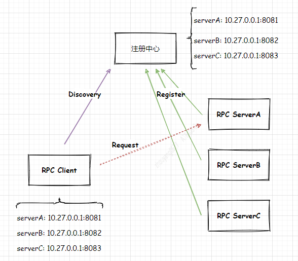

# 一致性Hash算法()

## 1. 背景
在高并发系统设计中 "Scale Out"(横向扩展)是最常用的方法，采用分布式部署的方式把请求或者处理分流开，让多个服务器都承担一部分请求或者处理。    

>那么如何拆分才能让服务器处理的请求的是均匀的？

## 2. 需求
在很多RPC框架中自行实现了`负载均衡`, 下面举例来体现`糟糕`的情况: 有3个RPC Server分别是: RPC ServerA,RPC ServerB,RPC ServerC, 它们Register到注册中心，而RPC Client会获取注册中心关于RPC Server的IP+PORT。此时Client根据获取的IP+PORT列表通过`算法`选择列表中的某一个IP+PORT请求RPC Server。  

`RPC调用图`     

> 引申出 一致性Hash算法实现RPC的负载均衡    

## 3. 一致性Hash算法介绍

## 4. Java实现