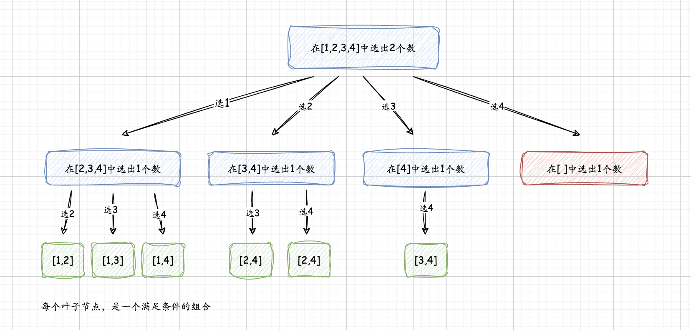
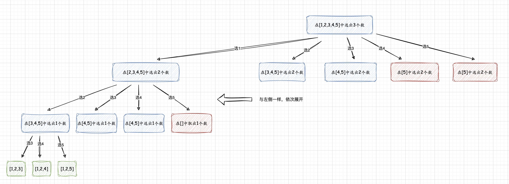

## 回溯算法

回溯（backtracking）算法，又称为试探算法，实际上类似于枚举的搜索尝试过程。它在搜索尝试过程中寻找问题的解，当发现不满足条件时，就“回溯”返回，尝试其他路径。回溯算法是一种选优搜索法，按选优条件向前搜索，以达到目标。当搜索到某一步，发现原先的选择并不优或达不到目标，就退回上一步重新选择。这种走不通就退回再走的方法成为回溯。


**有以下几个点需注意：**    
* 组合问题，若题意没有特别说明，是不计较一个组合内元素的顺序性，也就是[1,2,3]与[1,3,2]被认定是同一个组合。

* 回溯算法是在一棵树上的深度优先遍历，而遍历的树的深度是根据取几个数来定


回溯算法首先需要画出递归树，不同的树决定不同的代码实现。下面开始讨论实现过程

### 方法一： 根据搜索起点画出二叉树
根据Leetcode 77的题意描述，通过案例将树构建出来。例如输入：n=4，k=2, 树的构建流程： 
`在集合[1,2,3,4]中取出任意2个数组合`    
1. 在[1,2,3,4]中选出2个数，首先 选出第一个数是1
2. 在除1以外的[2,3,4]中选出1个数，那可以分别选择 2,3,4
以上2步，已满足取出任意2个数组合，所以这里可以推导出 当取出的数的个数满足k，表示已满足条件
3. 这里再做个推论 当k=3时， 那么在上一步选出2后，那么只会在剩余的[3,4]中在选出一个数...

综上所述，当从集合中取出一个数A后，再从剩余的元素中选出其他数，以此类推直到选出数的个数=k。这里会存在`剪枝`的概念后续会介绍，其目的就是提前总结归纳剩余的集合中能否选出满足k的集合，不满足则不继续对部分节点进行深度遍历，以减少遍历次数从而提高算法效率。



**Java代码如下**
```java
public class Backtracking {
    public static List<List<Integer>> combine(int n, int k) {
        List<List<Integer>> res = new ArrayList<>();
        if (k <= 0 || n < k) {
            return res;
        }
        // 从 1 开始是题目的设定
        Deque<Integer> path = new ArrayDeque<>();
        dfs(n, k, 1, path, res);
        System.out.println(JSON.toJSONString(res));
        return res;
    }

    private static void dfs(int n, int k, int begin, Deque<Integer> path, List<List<Integer>> res) {
        // 递归终止条件是：path 的长度等于 k
        if (path.size() == k) {
            res.add(new ArrayList<>(path));
            return;
        }

        // 遍历可能的搜索起点
        for (int i = begin; i <= n; i++) {
            // 向路径变量里添加一个数
            path.addLast(i);
            // 下一轮搜索，设置的搜索起点要加 1，因为组合数理不允许出现重复的元素
            dfs(n, k, i + 1, path, res);
            // 重点理解这里：深度优先遍历有回头的过程，因此递归之前做了什么，递归之后需要做相同操作的逆向操作
            path.removeLast();
        }
    }

    public static void main(String[] args) {
        combine(3, 2);
    }
}
```

简单对代码逻辑做一些介绍:   
* 树的构建及检索使用递归处理是最常见不过。
* 清楚递归的终止条件，而在本文中，停止调试是选出来数的个数=k，代码中的path集合是用于存放选出来的数 （path.size()==k）
* 在剩余元素中选出数，dfs的第三个参数 begin 表示的是集合中剩余元素的最小值（这里不要误解，因为本身题意中的n表示的数字，当n=4时，那一共有1,2,3,4 四个数） 所以在for中 dfs调用每次都是 i+1 表示是剩余元素的起点。
* path.removeLast()，res.add(new ArrayList<>(path)) 这两行代码，会有不少人有疑问， 那看上面的示例树结构图， 第一步在1,2,3,4选出1，第二步在2,3,4中选出2， 选出来的1,2会存在path集合中，当发现满足递归终止，利用`深拷贝思路`（new ArrayList<>(path)）创建新对象来存储临时结果，防止后续对path的操作会影响之前变量值， 当之前选择的1,2 满足后，递归终止后再遍历[2,3,4]中选出3，那path会存1,2,3，这显然不符合要求，所以在选择3之前，我们要将之前满足条件的2从path中取出，这样 path会存1,3 后面以此类推。
* path.addLast(i) 中的i表示的是 要取出的数

[1,2,3,4] 取 1 ->  path: [1], i+1: 2
[2,3,4] 取 2 -> path: [1,2], i+1: 3
此时将 [1,2] 构建新对象存在 res中, path: [1]
[2,3,4] 取 3 -> path: [1,3], i+1: 4
[2,3,4] 取 4 -> path: [1,4], i+1: 等于5 但不在1,2,3,4中，所以for循环截止

若以上介绍还有不清楚，可以纸上画图树的逻辑再总结取第一个数与取第二个数的处理逻辑。  


### 剪枝（优化：分析搜索起点的上界）
> `提前总结归纳剩余的集合中能否选出满足k的集合`   

在上面的代码，搜索起点遍历到 n, 在递归方法中重点是for循环
```java
// 遍历可能的搜索起点
for (int i = begin; i <= n; i++) {
    path.addLast(i);
    dfs(n, k, i + 1, path, res);
    path.removeLast();
}
```

若n=5，k=3，`从5开始取数就已经没有意义了`,这是因为：即使把5选出，后面的数只有6和7，一共就3个候选数，凑不出4个数的组合。因此，搜索起点有上界。 从下图树的展开案例中可以发现，会有`红色`标记的框已经无法在展开搜索，所以`剪枝`的目标是可以避免不必要的遍历，当n很大的时候，能少遍历很多节点，从而节约了时间



从上图可知，
例如：n = 6 ，k = 4。
path.size() == 1 的时候，接下来要选择 3 个数，搜索起点最大是 4，最后一个被选的组合是 [4, 5, 6]；
path.size() == 2 的时候，接下来要选择 2 个数，搜索起点最大是 5，最后一个被选的组合是 [5, 6]；
path.size() == 3 的时候，接下来要选择 1 个数，搜索起点最大是 6，最后一个被选的组合是 [6]；

再如：n = 15 ，k = 4。 path.size() == 1 的时候，接下来要选择 3 个数，搜索起点最大是 13，最后一个被选的是 [13, 14, 15]；
path.size() == 2 的时候，接下来要选择 2 个数，搜索起点最大是 14，最后一个被选的是 [14, 15]；
path.size() == 3 的时候，接下来要选择 1 个数，搜索起点最大是 15，最后一个被选的是 [15]；

归纳总结：
```
检索起点的上界 + 接下来要选择的元素个数 -1 = n
```
其中，`接下来要选择元素的个数` = k - path.size()，那么检索起点的上界：
```
检索起点的上界 = n - (k-path.size()) + 1 (公式转换)
```
所以，优化的剪枝过程就是： 把i<=n 改成 i<=n-(k-path.size()) +1:
```java
//只需优化递归的for即可
for (int i = index; i <= n - (k - path.size()) + 1; i++) {
    path.addLast(i);
    dfs(n, k, i + 1, path, res);
    path.removeLast();
}
```


>refer: https://leetcode.cn/problems/combinations/solutions/13436/hui-su-suan-fa-jian-zhi-python-dai-ma-java-dai-ma-/

Leetcode： https://leetcode.cn/problems/combinations/description/


