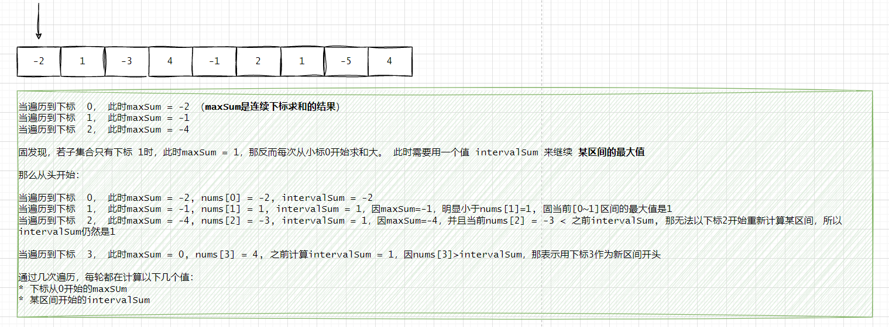

## 最大子数组和

### 题目
给你一个整数数组 nums ，请你找出一个具有最大和的连续子数组（子数组最少包含一个元素），返回其最大和。
子数组 是数组中的一个连续部分。

示例：  
```shell
输入：nums = [-2,1,-3,4,-1,2,1,-5,4]
输出：6
解释：连续子数组 [4,-1,2,1] 的和最大，为 6 。
```


### 解题

#### 贪心算法

**介绍**        
贪心算法是一种寻找在某种意义下的最优解的算法。它的工作原理是每次做出在当前看来最好的选择，也就是每一步都做出局部最优的选择，希望这样能导致全局最优解。  
贪心算法的基本步骤如下：    
1. 建立数学模型来描述问题。 
2. 把求解的问题分成若干个子问题。   
3. 对每一子问题求解，得到子问题的局部最优解。   
4. 把子问题的解局部合成原来问题的一个解。   

然而，贪心算法并不是对所有问题都能得到最优解，选择的贪心策略必须具备无后效性，即某个状态以前的过程不会影响以后的状态，只与当前状态有关。常见的应用贪心算法的问题包括：求图的最小生成树、求图的最短路径问题、背包问题等。        

要记住的一点是，虽然贪心算法可以解决一些优化问题，但并不是所有的问题都能用贪心算法有效解决。在使用贪心算法之前，我们需要确保问题拥有贪心选择性质和最优子结构性质。  

* 贪心选择性质：是指所求问题的整体最优解可以通过一系列局部最优的选择，也就是贪心选择得到。这是贪心算法可行的首要前提。  
* 最优子结构性质：是指在问题的最优解中包含了其子问题的最优解，如果一个问题没有最优子结构，那么就不能用贪心算法了。  

**结题思路：**  
因数组是包含负数，当遍历数组时，要得出截止当前下标下的最大值    
  

```java
public class maxSubArray {
    public static void main(String[] args) {
        int[] arr = {-2,1,-3,4,-1,2,1,-5,4};
        System.out.println(maxSubArray(arr));
    }

    public static int maxSubArray(int[] nums) {
        int n = nums.length;
        int currSum = nums[0], maxSum = nums[0];

        for (int i = 1; i < n; ++i) {
            currSum = Math.max(nums[i], currSum + nums[i]);
            maxSum = Math.max(maxSum, currSum);
        }
        return maxSum;
    }
}
```

