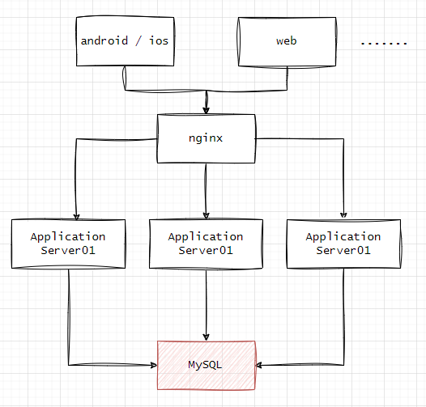
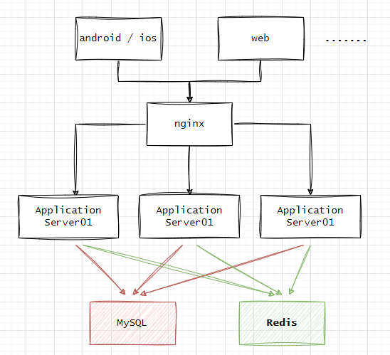
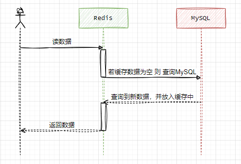

## 分布式Redis缓存接入    

### 引言    

**基本结构图**  
  

* step01 当服务请求量大大，往往第一步扩`Application Server`节点是我们首选  
* step02 当Server增加，访问MySQL需求也是急增，此时寻求支持并发高的存储  
* step03 集成Redis的KV，缓解MySQL读写需求。 

现在我们能看下新的结构   

      

我们一个最基本读写逻辑是：  

      

### Case分析    

#### 缓存集中失效   

* 服务启动时一次性加载缓存，并且设置过期时间    

* 内存不足导致缓存数据套餐      
maxmemory   缓存最大使用量  
maxmemory-policy 缓存淘汰策略   

#### 

