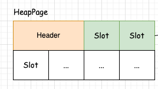

# byte 与 位运算 - 案例实战    

## 引言 
在 MIT 6.830课程 LAB 环节（https://github.com/MIT-DB-Class/simple-db-hw-2021/blob/master/lab1.md），有这样一段介绍：  

>2.5. HeapFile access method                      

Access methods provide a way to read or write data from disk that is arranged in a specific way. Common access methods include heap files (unsorted files of tuples) and B-trees; for this assignment, you will only implement a heap file access method, and we have written some of the code for you.                  

A HeapFile object is arranged into a set of pages, each of which consists of a fixed number of bytes for storing tuples, (defined by the constant BufferPool.DEFAULT_PAGE_SIZE), including a header. In SimpleDB, there is one HeapFile object for each table in the database. Each page in a HeapFile is arranged as a set of slots, each of which can hold one tuple (tuples for a given table in SimpleDB are all of the same size). In addition to these slots, each page has a header that consists of a bitmap with one bit per tuple slot.` If the bit corresponding to a particular tuple is 1, it indicates that the tuple is valid; if it is 0, the tuple is invalid (e.g., has been deleted or was never initialized.)` Pages of HeapFile objects are of type HeapPage which implements the Page interface. Pages are stored in the buffer pool but are read and written by the HeapFile class.                        
 

**这里会涉及到 byte 和位预算。**            

## Java byte  

为了更好的释义，下面通过结构图来说明 `HeapPage`;         
查看 https://github.com/MIT-DB-Class/simple-db-hw-2021/tree/master 仓库中的`HeapPage` 
```java
public class HeapPage implements Page {

    final HeapPageId pid;
    final TupleDesc td;
    final byte[] header;
    final Tuple[] tuples;
    final int numSlots;
...     
```
HeapPage 由 byte[] Header + Slot集合 组成，数据存放在 Slot中，为了知晓哪些 Slot是否存满数据，则将 Slot 是否存满字段存放在 Header中。    
  

>byte[] Header 如何体现出来 Slot的情况呢 ？                       

在Java中，byte是一个基本数据类型，它是一个8位的有符号整数, 在上面的案例中，用二进制来赋值 byte 变量会更加贴近真实，例如 `byte b = 0b00011010`,那b 对应的十进制的26，将变量 b 排除 `ob`前缀，那后面就是用0、1表示的8位数值，所以一个字节都标明8个Slot的存储信息。 

那基于上述逻辑，我们用示例来对这8位数值，进行set 0 和 set 1，此时注意，二进制数是从右往左开始读取的。   

```java
import org.junit.Before;
import org.junit.Test;

/**
 * 当 header = 0b00000000，
 * 现在将 0b 去掉，保留8个0： 00000000，从右往左开始数，0位，1位，2位 ... 7位
 * 每位上的 0、1 表示 不同含义
 */
public class ByteTest {
    byte header;

    @Before
    public void initHeader() {
        header = 0b00000000; // 初始时所有槽位都未被使用
    }

    /**
     * 那现在设置 0位 为1
     */
    @Test
    public void set_0_slot() {
        header = setBit(header, 0);
        System.out.println("Header after set 0th bit: " + Integer.toBinaryString(header));

        header = clearBit(header,0);
        System.out.println("Header after clear 0th bit: " + Integer.toBinaryString(header));
    }
    
    /*
        0
        1 << 0 :
        value: 仅限制，1 或者 0
     */
    private byte setBit(byte header, int bitIndex) {
        return (byte) (header | (1 << bitIndex));
    }

    public static byte clearBit(byte header, int bitIndex) {
        return (byte) (header & ~(1 << bitIndex));
    }
}
```


```java
import org.junit.Before;
import org.junit.Test;

public class ByteArrayTest {
    byte[] header;

    @Before
    public void initHeader(){
        header = new byte[]{(byte) 0b11111111, (byte) 0b11111111};
    }

    @Test
    public void set_1_3_slot(){
        markSlotUsed(10,false);
        System.out.println("Header after set 10th bit: " + String.format("%8s", Integer.toBinaryString(header[1] & 0xFF)).replace(' ', '0'));
    }


    private void markSlotUsed(int i, boolean value) {
        int headerbit = i % 8;
        int headerbyte = (i - headerbit) / 8;

        if(value)
            header[headerbyte] |= 1 << headerbit;
        else
            header[headerbyte] &= (0xFF ^ (1 << headerbit));
    }
}
```